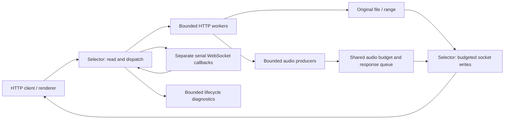

# SonicNIO streaming performance and reliability

Evidence date: **2026-10-03**. Scope: MusicMate's Android HTTP audio server, including original files, generated WAV, ranges, artwork and WebSocket control. This report consolidates the Grizzly-inspired implementation, current tests and device measurements, and historical SonicNIO/Netty records. It documents recorded executions; creating this report did not rerun the benchmarks.

**Throughput follow-up:** [Section 10](#10-throughput-follow-up) records subsequent code experiments and fresh measurements, including the current 162 core + 43 UPnP passing cases. Sections 1–9 preserve the earlier reliability-change measurements; their before/after builds differ from the follow-up baseline.

## 1. Findings and evidence strength

| Finding | Evidence | Interpretation |
|---|---|---|
| Original-file transfer speed was essentially unchanged | Same 9,940,667-byte FLAC over USB: 0.274 s before, 0.276 s after | No demonstrated raw-file throughput improvement |
| Seek and converted-WAV timings were lower in the device sample | Seek median 19.57 → 8.69 ms; WAV duration 2.593 → 1.251 s | Encouraging initial observations; insufficient repetitions to attribute the change solely to the implementation |
| Transferred audio remained correct in exercised scenarios | Original/converted SHA-256 equality, exact ranges, FLAC/ALAC PCM equality against Apple afconvert | Demonstrated byte correctness for the selected content and conversion profiles |
| Admission, cancellation, progress deadlines and callback isolation passed targeted regressions | 54 socket cases, four new direct component cases, fuzz and soak; all 156 core and 43 UPnP cases pass | Strong functional evidence for the exercised paths; finite tests do not eliminate every race |
| Load testing completed without reported errors | 32 clients, 16 s, 14,318 operations; 40 further socket-suite runs | Host-loopback evidence, not phone Wi-Fi or audible playback evidence |
| A Netty speed comparison remains uncertain | Historical measurements exist, but a silent fallback from Netty to SonicNIO is also documented | Do not certify the labelled runs as genuine Netty without active-engine evidence |
| App CPU, GC pause and playback continuity improvements remain unproven | Isolated ART metadata allocation/GC counters improve (§14); exact app runtime counters and renderer listening comparison remain open | Do not extrapolate microbenchmark savings to end-to-end performance |

Recorded implementation summary: [2026-10-03 streaming report](tasks/sonicnio-streaming-2026-10-03.md). Architectural constraints: [DESIGN.md, ADR-036 and ADR-037](DESIGN.md). Complete case inventory: [individual automated results](tasks/performance/sonicnio-2026-10-03/TEST_RESULTS.md).

## 2. Concepts and approach

### 2.1 What matters for music streaming

Peak download speed alone does not establish playback quality. A music server must deliver the exact bytes, start and seek promptly, sustain progress for the full track, keep control requests responsive, and release resources after cancellation. Artwork and browsing can create bursts while audio is already playing. Slow readers and expensive conversion must exert backpressure rather than creating an unlimited queue or interrupting an admitted stream.

The main targets were playback continuity, seek responsiveness and bounded resource use. The changes preserve the existing selector architecture and file-transfer path; they add no Grizzly dependency. Transport completion means bytes were transmitted, not that the renderer decoded or played them.

### 2.2 Concepts borrowed from Grizzly and comparison with Netty

Grizzly exposes probes for connection, allocation, thread-pool and HTTP request lifecycle events. SonicNIO adopts the monitoring concept through a compact bounded diagnostic snapshot rather than importing Grizzly's monitoring/JMX framework. [Grizzly monitoring documentation](https://javaee.github.io/grizzly/monitoring.html)

Grizzly's transport configuration separates selector and worker configuration and includes a pending-task queue limit. SonicNIO applies explicit queue and concurrency admission while preserving selector ownership of sockets. [Grizzly core configuration](https://javaee.github.io/grizzly/coreconfig.html)

Netty exposes write-buffer high/low watermarks through channel writability; accurate message-size estimation is necessary for that signal. SonicNIO's generated-audio queue and shared allocation budget provide its own producer backpressure. This is a conceptual comparison, not equivalent APIs or proof of equal performance. [Netty WriteBufferWaterMark documentation](https://netty.io/4.1/api/io/netty/channel/WriteBufferWaterMark.html)

| Concept | SonicNIO approach | Intended benefit | Evidence / decision |
|---|---|---|---|
| Explicit lifecycle ownership | Selector alone closes connections and changes socket interest; workers publish completed responses | Reduce cross-thread close/reuse races | Socket teardown, late response and WebSocket ordering regressions |
| Observable lifecycle outcomes | Request/connection IDs, expected/sent body bytes, first-write latency, terminal outcome and close reason | Diagnose incomplete transfers and stalls | Bounded-history and exact body-count tests |
| Progress-based timeouts | Separate header/body-read, handler, keep-alive, socket-write and producer phases; monotonic elapsed clock | Reclaim stalled work while allowing long healthy streams | Producer, handler, stalled-reader and long-stream tests |
| Fair writes | Original and generated bodies yield after 256 KiB per selector turn | Prevent one continuously ready stream monopolizing a turn | Controlled partial-write test; load soak |
| Backpressure and admission | Bounded handler queue, bounded producer concurrency, aggregate audio allocation budget | Bound in-flight work and generated chunks | Saturation, concurrent admission and cancellation tests |
| Workload isolation | Separate media/resource slots and independent WebSocket callback pool | Let artwork and control work coexist with admitted audio | Full media-capacity artwork test, HTTP overload/control test, device burst |
| Buffer reuse | Deferred | Potential allocation/GC reduction | No controlled GC evidence; avoid claiming a benefit |
| Slow-storage isolation | Deferred; original files retain FileChannel.transferTo | Potential reduction of selector stalls on cold/slow storage | No measured cold-storage bottleneck yet |

Fairness, phase-specific deadlines and isolation are MusicMate design choices informed by these framework patterns. This report does not claim that every choice reproduces a particular Grizzly implementation.

### 2.3 Before and after behavior

| Area | Before this change | After this change |
|---|---|---|
| Generated writes | No matching per-turn body byte budget | 256 KiB body budget, preserving pending buffer offsets |
| Handler work | Unbounded pending HTTP work | Default 128 queued handler tasks; overflow gets a self-delimiting 503 |
| Media admission | New work could evict an active stream | Atomic admission; full capacity refuses new work instead of evicting audio |
| Artwork/static file admission | Shared contention with media slots | Separate default 16 resource-transfer slots |
| Generated audio memory | Per-response bounded queue | Also a shared 8 MiB reservation budget covering queued, pending and producer-held chunks |
| Producer execution | No current explicit bounded admission policy | At most eight producer threads; no pending producer-job queue |
| WebSocket callbacks | Shared execution capacity with HTTP handlers | Dedicated two-thread pool and bounded per-session serial callbacks |
| Wakeups | Connection/key-based handoff | Handoff carries response identity to avoid stale wakeups on reused connections |
| Shutdown publication | Late worker result could arrive after stop | Late responses are closed; late wakeups/publication rejected |
| Stall diagnosis | Less phase-specific timeout/outcome information | Distinct stall phases and bounded terminal diagnostic history |

The previous server already had selector ownership rules, range handling, file write slices and producer parking. The implementation extends these mechanisms rather than replacing the streaming engine.

### 2.4 Pipeline and ownership



Workers construct responses; only the selector writes to sockets. An empty generated-body queue parks its connection by clearing write interest. A producer publishes an identity-bearing wakeup when data becomes available. Completion, disconnect, timeout, producer failure and shutdown release reservations and slots. Response history stores scalar/bounded textual information, not track objects, exceptions or audio buffers.

### 2.5 Default bounds and timeout semantics

| Setting | Default | Meaning / limitation |
|---|---:|---|
| HTTP pending handler tasks | 128 | Queued tasks; running worker count is separate |
| Audio producer threads | 8 | No queued producer jobs; rejection returns 503 |
| Generated chunks per response queue | 16 × 64 KiB | Queue capacity alone is not total retained audio memory |
| Shared generated-audio reservation budget | 8 MiB | Includes queued, pending and producer-held chunks; not a bound on the entire Android heap or codec internals |
| Body write allowance | 256 KiB per turn | Both file and generated paths; byte allowance is not a wall-time guarantee for slow storage |
| Resource-transfer slots | 16 | Artwork/WebUI file transfers, separate from media |
| Media slots | Core default: 2 × available processors | Configurable; effective application configuration must be recorded for a benchmark |
| Connection limit | Core default: 1,000 | Configurable; bounds do not establish optimal renderer tuning |
| WebSocket callback threads | 2 | Independent of HTTP workers |
| Pending callbacks per session | 256 | Overflow closes that session; terminal callback reserved after admitted callbacks |
| Diagnostic histories | 64 responses + 64 closes | Aggregate counts survive history rollover |
| Header-read deadline | 30 s | Bounds the header phase; does not cap a completed request's stream duration |
| Body-read deadline | 120 s | Separate request-body phase |
| Handler / write-stall / producer-stall | 120 s each | Configurable; successful transmitted bytes refresh write progress |
| HTTP keep-alive idle limit | 120 s | Idle connection phase |
| Timeout sweep interval | 1 s | Expiry is detected on sweeps, not at exact millisecond precision |

Same-connection seeks can reuse the connection. A new-connection seek at full media capacity is refused until an old transfer releases its slot. There is no total-duration cap on a progressing response. An empty producer queue must not be treated as a socket-write stall. Merely receiving an OP_WRITE event does not count as progress.

Implementation sources: [NioHttpServer](core/src/main/java/apincer/music/core/http/NioHttpServer.java), [StreamingResponse](core/src/main/java/apincer/music/core/http/StreamingResponse.java), [FileResponse](core/src/main/java/apincer/music/core/http/FileResponse.java), [AudioBufferBudget](core/src/main/java/apincer/music/core/http/AudioBufferBudget.java), [SerialExecutor](core/src/main/java/apincer/music/core/http/SerialExecutor.java), [StreamDiagnostics](core/src/main/java/apincer/music/core/http/StreamDiagnostics.java), and [UPnP HTTP adapter](server-jupnp/src/main/java/apincer/music/server/nio/NioWebServerImpl.java).

## 3. Measurement definitions and environment

### 3.1 Definitions

- **Client first-byte timing:** the Python device harness times from starting urllib.request.urlopen to its return, after response headers are available. It is a practical response-start proxy, not a separately instrumented arrival time of the first audio byte. The historical shell harness uses curl time_starttransfer, so the two measurements must not be treated as identical instrumentation.
- **Server first-byte timing:** diagnostic time from request processing to the first successful socket write, potentially header bytes. It is distinct from client timing and playback startup.
- **Seek latency:** response-start proxy for an HTTP byte-range request. It does not measure the renderer's audible seek completion or DLNA time-seek behavior.
- **Whole-transfer duration:** Python harness duration through full body receipt and length verification, measured before SHA-256 calculation; converted requests include server conversion/startup and transfer. It is not an isolated decoder throughput test.
- **Aggregate rate:** total completed payload bytes divided by wall time for four simultaneous transfers, including client-side hashing, thread-pool and verification overhead. MiB/s uses 1,048,576 bytes per MiB.
- **Percent change:** (after / before − 1) × 100. Negative values mean shorter duration/latency. Speedup for a duration is before / after.
- **Correct transfer:** required status where asserted, declared Content-Length received, expected exact bytes/ranges or matching hash. A successful timing without content checks is weaker evidence.
- **JUnit duration:** time spent executing a test, including assertions and waits. It is not request latency or a benchmark result.

### 3.2 Recorded environment and provenance

| Item | Recorded value |
|---|---|
| Phone | Samsung Galaxy S25; historical notes identify SM-S931B |
| Client host | macOS development workstation; precise hardware/OS/JDK versions were not retained in these result artifacts |
| Application | MusicMate debug build, package apincer.android.mmate; server port 9000 |
| Current device transport | ADB USB forwarding: host 127.0.0.1:19000 → phone TCP 9000 |
| Current original FLAC | Track 2122216336; 9,940,667 file bytes; decoded 16-bit stereo at 44,100 Hz |
| Current converted WAV | 29,529,404 file bytes; 29,529,360 PCM bytes + 44-byte header |
| Independent ALAC reference | Track 5563167; 37,355,520 PCM bytes, 16-bit stereo at 44,100 Hz |
| MP3 check | Track 2843233123; 7,518,635 file bytes |
| Historical Wi-Fi test | Galaxy S25 hotspot, Mac client, track 2021715542, reported 261 MB FLAC, 2026-10-01 |
| Current attempted Wi-Fi baseline | Large-track transfer did not complete; smaller baseline completed before installation only |
| Host tests | JVM unit/socket tests on host loopback; not Android radio or renderer tests |
| Working source anchor | master, HEAD 0d28ca052df66e23032d2c0afc0e3e6ba4e979bf, plus uncommitted streaming changes |
| Before/after identity limits | Before APK revision and APK hashes were not retained; current source digests are preserved, not an immutable benchmark commit |

The comparison did not control cache warmth, JIT compilation, thermal state, battery policy or repeated sample order. Debug-build observations are not production-release performance guarantees. A final Javadoc-only source edit occurred after device installation; the subsequently rebuilt APK has the same intended streaming behavior, but its binary identity was not recorded as the installed benchmark APK.

## 4. Device test methodology and individual results

### 4.1 Same-content USB before/after

The archived [phone-check harness](tasks/performance/sonicnio-2026-10-03/harness/phone-check.py) runs these stages sequentially for each build:

1. Download the original FLAC once; check body length against Content-Length, record status, timing and SHA-256.
2. Send 12 deterministic 256 KiB range requests. Start offsets are (i × 313337) modulo (file length − 262144). Require 206 and exact equality with the original slice; record response-start timings.
3. Download four whole originals using four client threads; require each hash to match the single original and compute aggregate completed-byte rate.
4. Request the same track with User-Agent `LG webOS TV DLNADOC/1.50`; require RIFF/WAVE framing and declared length, record converted timing/hash.
5. Check four 64 KiB converted ranges at offsets 0, 44, 12345 and 262144 against the complete WAV. Together with the 12 original ranges, this yields 16 range checks per build.

The harness stores the slowest of 12 seeks as `seek_p95_ms`; that field is **reported here as the maximum**, not a statistically robust p95. The individual 12 timings were not preserved, so other percentiles cannot be reconstructed. Its `parallel_MB_s` field divides by 1,048,576 and is therefore MiB/s despite the field name.

| Test / metric | Before | After | Observed change |
|---|---:|---:|---:|
| Original status / bytes | 200 / 9,940,667 | 200 / 9,940,667 | Identical |
| Original response-start proxy | 58.182 ms | 44.640 ms | −23.3% |
| Original full transfer | 0.274183 s | 0.275946 s | +0.6%; essentially unchanged |
| Original seek median, 12 requests | 19.567 ms | 8.695 ms | −55.6% |
| Original seek maximum, 12 requests | 21.632 ms | 15.284 ms | −29.3% |
| Four-original aggregate rate | 39.898 MiB/s | 40.647 MiB/s | +1.9% |
| Parallel original hash matches | 4 / 4 | 4 / 4 | Pass in both builds |
| Converted status / bytes | 200 / 29,529,404 | 200 / 29,529,404 | Identical |
| Converted response-start proxy | 30.424 ms | 10.290 ms | −66.2% |
| Converted full transfer | 2.592752 s | 1.250503 s | −51.8%; about 2.07× duration-based speedup |
| Exact original + converted ranges | 16 / 16 | 16 / 16 | Pass in both builds |

Raw results: [before](tasks/performance/sonicnio-2026-10-03/evidence/phone-before.json), [after](tasks/performance/sonicnio-2026-10-03/evidence/phone-after.json).

| Content | SHA-256, identical before and after |
|---|---|
| Original FLAC | `69619cbf611ad6711cfa7962916eec48879759dc7b839af8ba15b590eb818626` |
| Converted WAV | `edb1ab13ad8e8dc03e8e283a40dd30d6344672671b0186a2b72a58bb01f1b676` |

Interpretation: seek and converted-response timings were lower in this sample. The original whole-file time and parallel rate suggest no substantial raw-file speed change. One full-file and converted sample per build cannot establish confidence intervals, sustained conversion performance, or causation. Conversion requests occur after original/parallel reads and can benefit from warmed file caches.

### 4.2 Independent decoded-audio references

The [audio-reference harness](tasks/performance/sonicnio-2026-10-03/harness/audio-reference.py) reads the selected source from the phone, requests WAV through the LG user-agent conversion path, extracts its PCM, and compares it byte-for-byte with an independent decoder. Apple `/usr/bin/afconvert -f WAVE -d LEI16` produced the references used in both cases.

| Test | PCM bytes | Format | Reference | Result |
|---|---:|---|---|---|
| FLAC → WAV, track 2122216336 | 29,529,360 | 16-bit, stereo, 44.1 kHz | Apple afconvert | Exact PCM equality |
| ALAC → WAV, track 5563167 | 37,355,520 | 16-bit, stereo, 44.1 kHz | Apple afconvert | Exact PCM equality |

The FLAC STREAMINFO MD5 was all zero, so it could not be used as a decoded-audio checksum reference. These results establish the exercised native-format output; they do not establish high-resolution, resampled, MQA or every renderer profile. Using an LG user agent is not a physical LG television playback test. [Raw reference results](tasks/performance/sonicnio-2026-10-03/evidence/audio-reference.json)

### 4.3 Audio with artwork burst and MP3 ranges

The [artwork-burst harness](tasks/performance/sonicnio-2026-10-03/harness/artwork-burst.py) first obtains an expected FLAC hash. It then submits four original-audio downloads and 32 requests for one cover image to a 12-thread client pool. It requires all audio hashes to match and all covers to be nonempty and byte-identical. It subsequently downloads an MP3 and checks three 64 KiB ranges at offsets 0, 10000 and 100000.

| Test | Result |
|---|---|
| Four originals during artwork load | 4 / 4 matching SHA-256 |
| Cover burst | 32 / 32 nonempty, identical responses; each 293,656 bytes |
| MP3 whole file | 7,518,635 bytes; declared length received |
| MP3 ranges | 3 / 3 exact matches to original bytes |
| Recorded elapsed time | 1.455845 s, including the later MP3 download/range checks |

This is a correctness/coexistence check. The 12-thread pool means 36 submitted requests are not all simultaneously active; repeated requests for one image do not model cold thumbnails or a large browse database. No per-audio latency series or audible continuity measurement was captured. [Raw burst results](tasks/performance/sonicnio-2026-10-03/evidence/artwork-burst.json)

### 4.4 Wi-Fi, memory and logs

| Check | Observation | Valid conclusion |
|---|---|---|
| Large FLAC Wi-Fi baseline | First 261 MiB-class transfer did not finish after more than 11 minutes; process was stopped | Incomplete run; no usable throughput or before/after comparison; cause not established |
| Smaller Wi-Fi original, before only | 9,940,667 bytes in 7.315289 s; curl first-byte 0.063164 s; reported download speed 1,358,889 B/s | One completed baseline; no matched after sample |
| Idle Android PSS snapshots | Before 317,194 KiB; after 270,362 KiB | Different restart/state conditions; no demonstrated memory or GC improvement |
| Recent device logcat check | Last approximately 1,500 entries inspected; no fatal exception or streaming-stall report observed | No such event in the inspected window; not a full-session absence guarantee |
| APK installation and launch | Debug APK installed and launched on the connected Galaxy S25 | Deployment/startup check; not physical-renderer playback validation |

USB transfer measurements must not be used to claim a Wi-Fi speed increase. Historical PSS/log observations above are preserved in the earlier streaming report; raw phone dumps and original curl output are not included in the normalized evidence package.

## 5. Automated test methodology and results

### 5.1 Suite coverage and recorded results

The retained Gradle XML has **156 core cases and 43 UPnP cases, all passing with zero failures, errors or skips**. Core suite timestamps start at 2026-10-03T05:48:19Z; UPnP at 2026-10-03T05:23:14Z. These suites were not necessarily executed in the same Gradle invocation.

| Suite | Cases | Methodology / what it establishes |
|---|---:|---|
| NioHttpServerTest | 54 | Real host TCP sockets; deterministic file content; range, framing, teardown, timeout, admission and WebSocket assertions |
| StreamingResponseTest | 2 | Controlled always-writable channel with partial-write allowance and shared-budget/latch coordination |
| SerialExecutorTest | 1 | Block active callback, fill 256 pending entries, trigger overflow, verify ordered terminal callback |
| StreamDiagnosticsTest | 1 | Insert 200 outcomes/closes, verify history rollover, retained totals and immutable snapshots |
| NioHttpServerFuzzTest | 3 | Hostile/mutated HTTP and random WebSocket bytes; healthy range probes and drained resources |
| NioHttpServerSoakTest | 1 | Concurrent mixed traffic, exact payload checks, deliberate disconnects, final zero active connections/streams |
| ServerDiagnosticsTest | 5 | Diagnostic presentation calculations and boundary behavior |
| RateLimitingHandlerTest | 2 | Rate-limiting behavior, including artwork exception |
| Other core tests | 87 | Codec, registry/profile/header/artwork, playback, file, repository, queue, model and utility regressions |
| UPnP module tests | 43 | Browse/search/metadata, request checks, time parsing and time seek, feature/registrar behavior |
| **Total** | **199** | Functional/regression coverage; not 199 performance benchmarks |

Every individual method name, outcome and JUnit execution time is listed in [TEST_RESULTS.md](tasks/performance/sonicnio-2026-10-03/TEST_RESULTS.md), grouped by all 35 suites. Exact stimuli/assertions are available through each suite's source link. The [normalized JUnit evidence](tasks/performance/sonicnio-2026-10-03/evidence/junit-results.json) also retains timestamps and fuzz/soak output.

### 5.2 Targeted streaming regressions

All rows below passed in the retained final result. Thresholds here are test setups/assertions, not measured production response targets.

| Test / scenario | Methodology | Expected and observed result |
|---|---|---|
| sharedBudget_includesPendingBytesAndIsReleasedOnCancellation | Give two responses one 64 KiB shared budget; first writer accepts 137 bytes, second producer waits; cancel first | Pending chunk remains charged; second can proceed after cancellation; final usage zero; peak one chunk |
| continuouslyReadyBody_yieldsAfterBudgetAndPreservesPartialWrites | Produce ten 64 KiB chunks; first full turn then 137-byte partial writes | First body turn exactly 256 KiB; subsequent turns at most that; complete exact payload; double close releases slot once |
| overflow_reservesCloseAfterAdmittedMessages | Block running callback; enqueue 256 numbered messages then two excess; enqueue close and unblock | One overflow notification; 256 admitted messages in order, followed by terminal callback; excess callbacks absent |
| historyIsBoundedWhileTotalsKeepCounting | Add 200 completed responses and closes; take snapshot, then add another close | 64 entries retained per history; completed total 200; prior snapshot unchanged |
| streamLimit_refusesNewAudioAndAllowsArtworkWithoutEvictingPlayback | One media slot held by slow large-file client; request another audio and resource file | New audio 503; resource succeeds; active original keeps yielding bytes; zero evictions; eventual slot cleanup |
| workerOverload_returns503AndDoesNotStarveAnUpgradedWebSocket | Two blocked HTTP workers, one queued task, already upgraded WebSocket | Excess HTTP gets 503; WebSocket sequence callback executes; admitted HTTP finishes after release |
| producerLimit_refusesNewConversionAndReleasesItsSlot | One allowed producer occupied by paused generated stream; request another conversion | New conversion 503; first sends expected 1,000 bytes; stream/buffer usage returns to zero |
| responseCreatedAfterStop_isClosedInsteadOfLeftInTheQueue | Latch-block handler, stop server, allow handler to create a file response | Late response disposed; active stream and connection counts zero |
| simultaneousAdmission_neverExceedsMediaSlots | 16 concurrent response creators with two media slots | Exactly two 200 responses, fourteen 503 responses; usage two then zero after close |
| handlerDeadline_startsAfterTheRequestBodyArrives | 100 ms handler deadline; delay POST body 1.5 s across sweep | Complete POST reaches handler and returns 200; no handler timeout during body-read phase |
| handlerStall_hasADistinctCloseReason | 100 ms handler deadline with deliberately slow handler | Connection closes; HANDLER_TIMEOUT recorded |
| diagnostics_keepAliveResponses_haveDistinctIdsAndExactBodyCounts | Multiple responses on a persistent connection | Distinct request IDs and exact body byte counts, separate from wire headers |
| streamingResponse_slowProducer_doesNotSpinTheSelector | Delay generated body production; inspect write-call count | Parked producer avoids continuous writable-selector spin |
| streamingResponse_producerFailure_closesTheConnection | Generated producer sends a prefix then throws | Connection ends; diagnostic retains decoder failure and actual transmitted prefix count |
| streamingResponse_parkedProducer_hasAStallDeadline | Park generated response with no producer progress | Producer deadline reclaims connection with PRODUCER_STALL outcome |
| streamingResponse_producerPause_doesNotUseSocketStallDeadline | Pause producer while queue empty, with separate write/producer limits | Producer pause is not mistaken for socket backpressure |
| streamingResponse_clientDisconnect_stopsTheProducer | Disconnect client during generated response | Producer cancellation/cleanup occurs |
| longStream_outlivesHeaderAndWriteStallDeadlines | Set both limits to 500 ms; read 8 MiB at about 4 MiB/s for more than one second | Entire body received after both durations have elapsed; healthy progress survives |
| stalledReader_isClosedAfterTheWriteStallTimeout | 1 s write-stall limit; small receive buffer; client never consumes body | Active stream reclaimed within test's six-second bound; WRITE_STALL recorded |

The remaining socket cases exercise whole files; closed/suffix/open-ended ranges; range end clamping and 416 reuse; malformed/multiple/If-Range handling; HEAD and bodyless framing; keep-alive; WebSocket echo/order/upgrade pipelining/close/error; split and same-packet POST bodies; disconnect; startOffset precedence; counters; stop-before-run and stop-during-handler; MIME content detection; Connection: close; unsupported chunked requests; 304 while audio is active; Expect: 100-continue; HTTP pipelining; HTTP/1.0 closing; and slow headers. Each has a separate recorded result in the appendix.

### 5.3 Fuzz methodology and current results

| Test | Workload and checks | Current result |
|---|---|---|
| hostileRequests_neverBreakTheServer | Fixed corpus of 23 hostile requests; acceptable refusal/close behavior; healthy server probe after each; resources drain | Pass |
| mutatedRequests_neverBreakTheServer | 1,500 mutations; seed 749127913864458; periodic valid 100-byte range probes; final health/drain checks | Pass |
| randomWebSocketFrames_neverBreakTheServer | 40 random frames after upgrade; seed 749121491257666; refusal/reset acceptable; final health/drain checks | Pass |

Fuzz assertions check resilience and framing/health, not comprehensive protocol conformance. A malformed request timing out while waiting for missing input is an acceptable outcome in this harness. Historical 20,000-mutated-request and 1,000-WebSocket-frame hunts are recorded in tasks/todo.md; their raw seed/output artifacts are not preserved here. The historical queued-PING-then-invalid-frame connection leak has a dedicated regression in the current socket suite.

### 5.4 Soak methodology and results

The [soak test](core/src/test/java/apincer/music/core/http/NioHttpServerSoakTest.java) uses a deterministic 4 MiB file with bytes i modulo 251. Each client randomly chooses whole-file reads, ranges, persistent-connection requests, deliberate mid-stream resets or WebSocket bursts. The server permits 256 media streams during this steady-state test; saturation is checked separately. At the end it waits up to ten seconds for active streams/connections to drain and requires zero collected errors. Deliberate resets are test traffic, not counted as failed expected transfers.

| Recorded run | Clients / duration | Operations | Aggregate rate | Range TTFB p50 / p95 | Errors |
|---|---|---:|---:|---:|---:|
| Final full core-suite XML | 16 / 8.0 s | 5,560 | 606.7 MiB/s | 9.402 / 38.943 ms | 0 |
| Separate current extended run, earlier report | 32 / 16 s | 14,318 | 789.3 MiB/s | 8.185 / 21.788 ms | 0 |

The host harness labels its aggregate rate MB/s but divides by 1,048,576; the table uses MiB/s. The extended run is retained as a reported observation from the earlier session summary; its original stdout/seed is not in this evidence snapshot. Both runs verify cleanup and exercised payload checks. Different client counts, random operation mixes and host conditions prevent using their rates as a before/after comparison. These short soaks do not establish hours-long playback or phone network throughput.

### 5.5 Repetition, failures and build verification

| Check | Result | Interpretation |
|---|---|---|
| Socket-suite repetition with FINE lifecycle traces | 20 runs × 54 cases = 1,080 passes | All retained log summaries say OK (54 tests) |
| Socket-suite repetition with ordinary logging | 20 runs × 54 cases = 1,080 passes | Passed without trace logging changing scheduling |
| Combined repetitions | 2,160 passing test executions | Repeated executions, not additional unique tests |
| Focused HTTP/1.0 close-response stress | 5,000 exchanges passed, as recorded in streaming summary | No retained standalone raw output in this package; distinct from suite repeats |
| Debug assembly | Passed; APK installed and launched | Build/deployment evidence recorded in prior session |
| Whitespace/diff checks | git diff --check passed during implementation | Broad main comparison included earlier branch work; incremental implementation reviewed against HEAD |

The initial repetition attempt observed an HTTP/1.0 case with a missing parsed Connection header on run 4. Raw-header failure context was added; later 40 full-suite repetitions and 5,000 focused exchanges did not reproduce it. The cause remains unknown. The successful repeats do **not** establish that the original intermittent disconnect/stop/header failures were fixed.

An intermediate progress-deadline run also failed the old stalled-reader test because it still configured the keep-alive/idle timeout. The test was updated to exercise the new write-stall timeout explicitly; the final WRITE_STALL regression passes. This is separate from the unexplained HTTP/1.0 failure.

[Repeat results and original-log hashes](tasks/performance/sonicnio-2026-10-03/evidence/repeat-results.json). Archived repeat harnesses invoke JUnitCore and check each process exit code. They require a freshly built classpath; their historical /private/tmp paths are prerequisites, not portable ready-to-run commands.

## 6. Historical comparisons

### 6.1 SonicNIO and Netty-labelled Wi-Fi runs

Source: tasks/todo.md, “SonicNIO to top grade (2026-10-01),” after f1438181, and DESIGN.md ADR-037. These used the Galaxy S25 hotspot, Mac client and reported 261 MB FLAC. The [LAN benchmark script](tools/bench/stream-bench.sh) measures one full transfer, 20 random 256 KiB seeks, four parallel full transfers, and optional sampled app CPU via adb top.

| Historical metric | SonicNIO | Netty-labelled runs |
|---|---:|---:|
| Single transfer | 8.0–9.1 MB/s as recorded | 5.0–9.2 MB/s as recorded |
| Seek TTFB p50 | 28–36 ms | 32–42 ms |
| Seek TTFB p95 | 62–134 ms | 69–108 ms |
| Four-transfer aggregate | 7.7–8.4 MB/s as recorded | 8.4–10.0 MB/s as recorded |
| Sampled app CPU | 5–6% | 4% |

The shell script's current implementation divides rates by 1,048,576 while printing MB/s. The historical table preserves its recorded labels; no original output establishes whether every historical script revision used the same calculation. CPU percentages depend on the device top output, sample selection and normalization; these are historical observations, not a current controlled CPU comparison.

**Active-engine uncertainty:** ADR-037 also records that missing packaged META-INF/io.netty.versions.properties caused the Netty constructor to throw and CompositeWebServer to fall back silently to SonicNIO while the UI displayed Netty. This evidence package contains no per-run Server header/startup log proving whether the labelled benchmark runs used genuine Netty after a repair. Therefore the numbers cannot support a certified Netty ranking or the claim that Netty was inherently slower. A future comparison must verify the active implementation before each run.

Netty was retired; the current application has one streaming engine. The recorded approximately 3.5 MB APK reduction concerns dependency removal, not a measured improvement from this Grizzly-inspired change. No direct Grizzly performance benchmark was run.

The current approximately 40.6 MiB/s USB aggregate cannot be compared with the historical 8–10 MB/s Wi-Fi aggregate to claim a fourfold engine speedup: network path, content size, build and measurement conditions differ.

### 6.2 Earlier host improvements and invalid measurements

| Historical observation | Before | After / result | Limit |
|---|---|---|---|
| Removal of request/connection object pools, three runs each | 648–728 MB/s; TTFB p50 5.0–5.7 ms, p95 13–27 ms | 685–752 MB/s; p50 4.3–4.9 ms, p95 6.8–23 ms | Earlier change, host JVM; not current before/after and no retained raw runs here |
| Earlier mixed-load baseline | About 700 MB/s; 16-client p50/p95 4.6/24 ms; 64-client 18.8/75 ms | Zero reported errors and drained counters | Different workload/concurrency; do not rank against current soak rates |
| Producer parking regression sensitivity | Removing parking reportedly caused about 2.4 million handleWrite calls per idle second | Current parking test passes | Historical diagnostic observation, not CPU percentage measurement |
| Previously claimed 33 MB/s Wi-Fi parallel rate | Header deadline prematurely ended streams at 30 s; script assumed complete bodies | Invalid measurement, excluded | Must count actual received bytes and failures |
| One earlier four-stream Wi-Fi run | Four of four transfers failed, hotspot tethering errors noted | Unreproduced | Cause and engine attribution not established |

Historical entries are contextual evidence from the task/design records. They are not normalized raw results in the current package.

## 7. Reproduction and stronger comparisons

### 7.1 Automated checks

From the repository root:

```sh
./gradlew :core:testDebugUnitTest :server-jupnp:testDebugUnitTest :app:assembleDebug
```

Force actual test execution when measuring again rather than reusing up-to-date results:

```sh
./gradlew :core:testDebugUnitTest --tests 'apincer.music.core.http.*' --rerun-tasks
SOAK_CLIENTS=32 SOAK_SECONDS=16 ./gradlew :core:testDebugUnitTest --tests apincer.music.core.http.NioHttpServerSoakTest --rerun-tasks
FUZZ_SEED=749127913864458 FUZZ_CASES=1500 FUZZ_WS_CASES=40 ./gradlew :core:testDebugUnitTest --tests apincer.music.core.http.NioHttpServerFuzzTest --rerun-tasks
```

The recorded HTTP and WebSocket fuzz seeds differ; one FUZZ_SEED invocation above reproduces the HTTP mutation seed and applies it to WebSocket generation too. Use a separate method-filtered run with FUZZ_SEED=749121491257666 to reproduce the recorded WebSocket seed. Save fresh XML/output and check the Gradle exit code; stale result files alone are not evidence of a successful run.

### 7.2 Device harnesses

With the connected phone's MusicMate server enabled and the recorded track present:

```sh
adb forward tcp:19000 tcp:9000
python3 tasks/performance/sonicnio-2026-10-03/harness/phone-check.py http://127.0.0.1:19000 rerun
python3 tasks/performance/sonicnio-2026-10-03/harness/artwork-burst.py
```

These are archived session harnesses with fixed track IDs, cover path and /private/tmp output locations. The artwork path must exist in the current library. The independent-reference harness also requires the session's local SQLite database at /private/tmp/musicmate-baseline.db, adb at its recorded macOS SDK path, access to the source tracks and Apple afconvert; it needs environment adaptation before reuse. Run it on the recorded native 16-bit sources rather than assuming its LEI16 reference covers other bit depths.

For LAN measurements:

```sh
tools/bench/stream-bench.sh PHONE_IP TRACK_ID sonicnio-current
```

Use a real ID from a /music/ID/file URL. The script's header comment still references a removed engine setting; switching that setting is not available in the current app. It has no comprehensive wall-time bound or hash verification and its printed MB/s uses binary units. Wrap a future run in an explicit execution deadline, retain HTTP statuses/content checks and avoid treating a labelled run as active-engine proof.

### 7.3 Protocol for a defensible future before/after or Netty comparison

1. Archive both source revisions, clean/dirty diff, APK SHA-256, build variant, JVM/device/OS versions, effective limits and benchmark harness revision. For Netty, use an isolated historical checkout or comparison implementation and prove successful startup/active Server header; do not infer engine identity from a setting or label.
2. Keep phone, client, network path, signal strength, content/profile and concurrency identical. Measure USB and Wi-Fi as separate datasets. Record thermal/battery state and background workload.
3. Separate cold-start/cold-file results from warmed steady-state results. Alternate before/after order and collect repeated whole/conversion samples and a sufficiently large seek distribution. Preserve every sample and compute p50/p95/p99 with an explicit percentile convention.
4. Require expected HTTP status, length, Content-Range and byte/hash equality for each transfer. Record rejected work and incomplete transfers explicitly. Never substitute requested bytes for bytes actually received.
5. Run native FLAC/MP3/ALAC, conversion profiles, large/high-resolution content, slow readers, seeks during artwork/browse load, disconnect/reconnect and sustained playback. Measure failure rate and control/seek tail latency alongside throughput.
6. Sample CPU using a documented normalization, active/peak PSS or heap, allocation rate, GC count/pause, producer budget peak, worker wait, selector-turn duration and file descriptor/connection cleanup. Compare equal sustained workloads rather than idle snapshots.
7. Verify audio on real available HiBy/LG/Sony renderers: initial startup, pause/resume, repeated seek, full-track continuity and artwork/browse bursts. Record renderer model/firmware and user-agent/profile. Listen and correlate server events with any dropout.
8. Publish the raw measurements, uncertainty/dispersion and failures. Retain an optimization only if it improves the target without compromising bytes, admitted audio, cleanup or responsiveness.

## 8. Outstanding work and conclusions permitted by the evidence

- Investigate the unexplained HTTP/1.0 parsed-header failure and earlier intermittent disconnect/stop reports. No demonstrated root cause is claimed fixed by successful repetition alone.
- Obtain matched Wi-Fi before/after samples with deadlines, status/byte verification and multiple runs.
- Establish active-engine proof before any new Netty claim. There is no current controlled head-to-head against Netty or Grizzly.
- Measure CPU, active-memory bounds, allocation/GC, battery effects and cold-storage selector stalls. Defer buffer pooling and storage-reader isolation until justified.
- Verify physical renderer playback and high-resolution/resampled/MQA profiles. The earlier possible HiBy/MQA dropout was not reproduced and is not established as fixed.
- Tune configurable queue, concurrency and timeout defaults from broader renderer behavior. Current test configurations are not recommended production tuning values.

The supported conclusion is that the exercised implementation now has verified overload isolation, fair generated writes, explicit progress deadlines, bounded generated-buffer ownership and useful transport diagnostics. The USB sample shows lower seek and converted-WAV timings with essentially unchanged original-file throughput. It does not establish general Wi-Fi, CPU, GC, audible-playback or Netty performance superiority.

## 9. Evidence index

| Artifact | Contents |
|---|---|
| [Individual automated results](tasks/performance/sonicnio-2026-10-03/TEST_RESULTS.md) | Every retained core/UPnP test case, result and execution time |
| [JUnit snapshot](tasks/performance/sonicnio-2026-10-03/evidence/junit-results.json) | 35 suites, 199 cases, UTC timestamps, durations, fuzz seeds and default soak stdout |
| [Repeat snapshot](tasks/performance/sonicnio-2026-10-03/evidence/repeat-results.json) | 40 runs, test counts, execution durations and SHA-256 of original temporary logs |
| [Before device results](tasks/performance/sonicnio-2026-10-03/evidence/phone-before.json) | Original/converted timing, hashes, range counts and parallel rate |
| [After device results](tasks/performance/sonicnio-2026-10-03/evidence/phone-after.json) | Same metrics after implementation |
| [PCM reference results](tasks/performance/sonicnio-2026-10-03/evidence/audio-reference.json) | Independent FLAC/ALAC decoded-audio equality |
| [Artwork/MP3 results](tasks/performance/sonicnio-2026-10-03/evidence/artwork-burst.json) | Burst counts, mixed-scenario elapsed time and MP3 ranges |
| [Manifest](tasks/performance/sonicnio-2026-10-03/evidence/manifest.json) | Source anchor/state, source and archived evidence/harness digests |
| [Historical harness directory](tasks/performance/sonicnio-2026-10-03/harness/) | Exact available session scripts; prerequisites and limitations described above |
| [Earlier implementation report](tasks/sonicnio-streaming-2026-10-03.md) | Extended soak and focused stress observations, verification and unresolved issues |
| [Design records](DESIGN.md) / [task history](tasks/todo.md) | ADR-036/037 constraints, historical engine/pooling measurements and invalid-run context |

Normalized snapshots preserve available results beyond temporary-directory cleanup. Hashes of original repeat logs establish their identity but do not preserve their full content; unavailable raw artifacts are explicitly identified in the relevant sections. No missing measurements have been reconstructed or invented.

## 10. Throughput follow-up

### 10.1 Scope and retained behavior

This follow-up compares the already-improved reliability implementation with two throughput experiments. It is not another measurement of the older pre-reliability build from section 4, and neither side is Netty.

- **PCM batching is enabled by default**, with `setBatchGeneratedAudio(false)` available before server startup for comparisons or diagnosis. Small writes combine into reserved chunks up to 64 KiB when audio is already queued. When there is no queued audio, allocation uses the actual incoming write size and publishes promptly. The selector can take a partial producer chunk when queued data runs out, including at a write-budget boundary; it must not park while produced bytes remain deliverable. Completion flushes the tail. Failure and cancellation release the partial batch exactly once.
- **File budgets are configurable but remain 256 KiB by default.** `setFileWriteBudgets(sharedBytes, soloBytes)` accepts ordered 64 KiB–1 MiB allowances before startup. The solo allowance applies only when exactly one connection is active and one key is selected; concurrent/idle connections use the shared allowance. Experiments with 512 KiB and 1 MiB did not establish a consistent native-file benefit, so no larger default was retained.
- The shared 8 MiB reservation limit, 16 queued chunks per response, 256 KiB generated write budget, stream admission and overload isolation remain in force. This is batching, not a reusable buffer pool or a decoder replacement.

### 10.2 Host methodology and provenance

The reproducible [ThroughputBenchmark.java](tools/bench/ThroughputBenchmark.java) and [instructions](tools/bench/README.md) use deterministic 16 MiB content on host loopback. Every whole response must have status 200, the declared length and matching SHA-256; every range must have status 206 and exactly match its 64 KiB reference slice. Each server has four HTTP workers and 16 media slots. The workloads are:

| Workload | Client behavior | What it isolates |
|---|---|---|
| file-single | One persistent connection repeatedly reads the entire original file | Native-file path with solo-budget eligibility |
| file-four | Four persistent full-file clients and a fifth range client, with 10 ms between seeks | Native-file throughput with small-request contention |
| pcm-four | Four generated-body clients; producer writes synthetic 4 KiB blocks; fifth client seeks an original file | Small-write transport overhead; does not include audio decoding or WAV framing |

Each workload has a two-second unreported warmup and three two-second measured load periods. The last request finishes after the period ends. Throughput counts completed full bodies and excludes range bytes. Its elapsed time includes client allocation/hashing. TTFB is the first response-header byte; run p95 is sorted element floor(N × 0.95). Tables below report the median throughput and **median of the three run p95 values**, not a pooled p95. Resource checks require zero remaining connections, streams and audio reservations. Any exception rejects the configuration, rather than counting incomplete transfers as complete.

Baseline sources were hashed before edits. The initial runtime classpath referred to a mutable build JAR rather than the javac directory, so it was not a durable bytecode snapshot. For repeated baseline runs, the three original production sources were reconstructed in scratch, verified byte-for-byte against those pre-edit SHA-256 values, compiled into an isolated directory, and placed before the current runtime JAR in the classpath. The archived [baseline-to-retained patch](tasks/performance/sonicnio-throughput-2026-10-03/evidence/baseline-to-retained.patch) and [manifest](tasks/performance/sonicnio-throughput-2026-10-03/evidence/manifest.json) retain the source identities and difference. The benchmark classpath-export task is now [checked into the repository](tools/bench/test-classpath.gradle).

There are 99 successful measured host samples across baseline, prototype matrix, final implementation and file-budget confirmation phases. These are short, same-JVM client/server experiments with fresh JVM/server warmup, client GC/hash costs and uncontrolled background/thermal variation. Prototype rows predate the final parking/startup-allocation refinements; only rows labelled retained-batch describe the retained batching implementation. The final comparison ran batching first, then the baseline; it is not a randomized interleaved statistical study.

### 10.3 Host results and comparisons

Final source-verified comparison, three measured samples per cell:

| Metric | Baseline | Retained batching | Observed change |
|---|---:|---:|---:|
| Single original-file rate | 686.701 MiB/s | 651.484 MiB/s | −5.1% in this batch |
| Four original-file aggregate rate | 1,581.892 MiB/s | 1,509.709 MiB/s | −4.6% in this batch |
| Four synthetic generated-body rate | 169.054 MiB/s | 1,070.370 MiB/s | **6.33×**; approximately +533% |
| Run seek p95 median during original-file load | 3.113 ms | 3.184 ms | +2.3% |
| Run seek p95 median during generated-body load | 3.961 ms | 3.656 ms | −7.7% |
| Highest run seek p95 during generated-body load | 4.711 ms | 4.016 ms | −14.8% |
| Peak generated reservation during generated-body load | 278,528 bytes | 4,718,592 bytes | Higher in-flight chunk capacity, within the 8 MiB bound |

Single-file confirmation gave 694.210 MiB/s baseline and 674.564 MiB/s retained, a 2.8% lower median. An earlier final-source precursor gave four-file medians 1,593.753 and 1,586.809 MiB/s, a 0.4% difference. **Native-file performance did not improve; several host batches were lower after the change.** Short-run variation and the common client/server JVM prevent confidently separating noise from a small regression. These observations must remain visible; they are not evidence of unchanged host performance or a native-file speedup. Longer interleaved profiling is required to resolve the modest difference.

The generated-body improvement was consistent across the matrix: approximately 168–174 MiB/s without batching versus 1,035–1,037 MiB/s with the precursor batching, then 1,070 MiB/s with retained batching. The inferred mechanism is fewer small-buffer publications and socket writes, supported by the direct component test requiring fewer than ten writes for a body produced in roughly 65 small calls. Allocation/GC and CPU reductions were not independently measured.

| File-budget experiment | Single-file median | Decision |
|---|---:|---|
| 256 KiB with batching, precursor matrix | 673.794 MiB/s | Reference for that matrix |
| 1 MiB solo with batching, same matrix | 665.576 MiB/s | No demonstrated improvement; do not raise default |
| 512 KiB solo, retained implementation | 676.141 MiB/s | Similar to later 256 KiB confirmation; insufficient evidence to raise default |
| 256 KiB retained confirmation | 674.564 MiB/s | Retain conservative default |

These experiments do not imply a sixfold improvement in a music decoder, Android Wi-Fi rate or renderer playback. The native paths and decoder costs are different bottlenecks. [All host samples](tasks/performance/sonicnio-throughput-2026-10-03/evidence/host-results.json), [calculated summaries](tasks/performance/sonicnio-throughput-2026-10-03/evidence/summary.json).

### 10.4 Matched phone comparison

The Galaxy S25 remained connected over ADB USB forwarding. The archived phone-check harness from section 4 ran three times on the installed reliability build before tuning, then three times after the first tuned APK and three times after the retained implementation. All runs used the same track/profile and 12 original ranges, four converted ranges, four concurrent whole files and SHA-256 checks. The initial/retained APK hashes are recorded; the retained installed hash matches the built local APK.

The primary table compares the three before runs with the three retained-after runs. Values are medians across runs; “seek median” is the median of each run's 12-request median, and “seek maximum” is the median of each run's maximum. Neither is a pooled percentile.

| Metric | Before tuning | Retained implementation | Observed change |
|---|---:|---:|---:|
| Original full-file duration | 0.264714 s | 0.266425 s | +0.6%; essentially unchanged |
| Original response-start proxy | 31.991 ms | 37.425 ms | +17.0% |
| Original seek median | 15.073 ms | 11.150 ms | −26.0% |
| Original seek maximum | 24.133 ms | 21.629 ms | −10.4% |
| Four-original aggregate rate | 39.284 MiB/s | 39.953 MiB/s | +1.7% |
| Converted-WAV duration | 0.852291 s | 0.830846 s | −2.5%; no substantial gain established |
| Converted response-start proxy | 22.203 ms | 26.391 ms | +18.9% |
| Exact ranges per phase | 48 / 48 | 48 / 48 | All original and converted slices correct |
| Concurrent original hash matches per phase | 12 / 12 | 12 / 12 | All correct |
| Original/converted hashes across builds | Reference | Identical | Content preserved |

The first retained-after WAV took 0.977 s, followed by 0.827 s and 0.831 s. Before values were 0.852 s, 0.811 s and 0.884 s. Installation/restart, cache/JIT state and USB/client noise were not controlled or alternated. The first tuned-build median was 0.873 s and is also preserved; selecting only faster samples would misrepresent the result. The practical conclusion is **no demonstrated substantial real-phone throughput gain**, despite greater synthetic small-write headroom. Improved seek timings and slower response-start timings are observations, not established causal effects.

[All nine phone runs](tasks/performance/sonicnio-throughput-2026-10-03/evidence/phone-results.json). The three first-after runs also passed their 48 range checks and 12 parallel hash checks. Across all nine runs, 144 ranges and 36 parallel hashes passed. No matched Wi-Fi, CPU/GC/battery or physical-renderer continuity measurement was added.

### 10.5 Failures, regression coverage and validation

A prototype generated response was cut short during the no-batching control run. Lifecycle diagnostics showed a producer NullPointerException calling flip on a cleared producerBuffer after transmitting 69,632 of 16,777,216 expected bytes. A producer waiting for queue space releases the monitor; the selector can drain its partial buffer before it reacquires that monitor. Publication now rechecks ownership after the wait, and both parking and producer-stall detection recognize deliverable partial batches. The comparison was stopped, the cause fixed and a focused regression added before successful runs resumed. [Rejected experiment record](tasks/performance/sonicnio-throughput-2026-10-03/evidence/failed-experiment.json)

Six additional regression cases passed:

| Test | Method and observed result |
|---|---|
| selectorDrainingWhileProducerWaitsForQueueSpace_preservesEveryByte | Fill all 16 queue slots with 4 KiB writes; wait for the seventeenth producer-held chunk to block; selector drains queued/held bytes; producer resumes and whole payload is exact, with no failure or retained reservation |
| smallWrites_areBatchedWithoutChangingBytesOrFinalTail | Produce four 64 KiB chunks plus a 123-byte tail in 4 KiB calls; fewer than ten channel writes, identical complete body, zero reservations |
| pausedProducer_partialBatchIsDrainedBeforeParking | Queue a full 256 KiB selector budget and stage 4 KiB; first turn yields, partial bytes prevent parking/false producer-wait classification, next turn drains them |
| partialBatch_isReleasedWhenProducerFailsOrIsCancelled | Queue a 4 KiB startup prefix and hold a partial 64 KiB batch; failure releases the held batch, cancellation releases all remaining ownership |
| shortProducer_flushesFirstBytesBeforePausingAndStillFailsLengthCheck | Publish three bytes immediately from a declared 1,000-byte response; pause is observable without full-chunk delay; short completion still fails and releases memory |
| changingTurnBudget_preservesFileOffsetsAndExactTail | Write 1 MiB, then 256 KiB, then a 123-byte file tail; no lost/duplicated bytes and exactly one slot release |

The final checks passed **162 core + 43 UPnP = 205 unique tests**, zero failures/errors/skips, and debug assembly. The benchmark-classpath export task was exercised successfully. The retained APK was installed and launched, and USB verification used that installed APK. [All 205 individual results](tasks/performance/sonicnio-throughput-2026-10-03/TEST_RESULTS.md), [JUnit snapshot](tasks/performance/sonicnio-throughput-2026-10-03/evidence/junit-results.json).

The earlier unexplained HTTP/1.0 failure remains unresolved; the demonstrated batching race is a separate issue. This work does not establish that the possible HiBy/MQA dropout or all historical intermittent closures are fixed. No verified Netty or Grizzly head-to-head was performed. Remaining gates are controlled native-file regression profiling, matched Wi-Fi measurements, active-engine proof for any Netty run, allocation/GC sampling and audible playback on real renderers.

## 11. Metadata encoding follow-up

Implemented the first recommendation from the [Hella/yelmach source review](tasks/sonicnio-http-server-research-2026-10-03.md): encode only the eight digest bytes retained in ETags and share an immutable English/GMT date formatter, with legacy formatting for unusual timestamps. Validators, dates and audio content remain byte-identical. General header encoding, request parsing, pooling and transfer budgets were held constant.

| Measurement | Before | After | Observed change |
| --- | ---: | ---: | ---: |
| ETag allocation | 13,576 bytes/op | 776 bytes/op | −94.3% |
| Date allocation | 2,920 bytes/op | 384 bytes/op | −86.8% |
| 304 response/header preparation | 38.917 µs | 33.811 µs | −13.1% |
| 206 response/header preparation | 126.173 µs | 119.261 µs | −5.5% |
| Host single-stream throughput | 685.138 MiB/s | 685.595 MiB/s | +0.07%; unchanged |
| Host four streams with seeks | 1,447.468 MiB/s | 1,453.167 MiB/s | +0.39%; unchanged |
| Phone seek median | 16.282 ms | 7.804 ms | −52.1%; small sample |
| Phone four-stream throughput | 39.4365 MiB/s | 39.4293 MiB/s | −0.02%; unchanged |
| Phone converted-WAV duration | 0.855262 s | 0.840616 s | −1.7%; no substantial gain |

Retained 120 host preparation/allocation samples, 24 host transfer samples and six interleaved phone runs. Phone installs were SHA-256 verified and received a complete warmup before each retained workload. All retained phone runs passed 96 exact ranges, 24 concurrent hashes and six metadata probes. Full validation passed **164 core + 43 UPnP = 207 tests**, zero failures/errors/skips, and debug assembly. The optimized APK remains installed.

The clear outcome is reduced response-preparation allocation. Phone latency is promising, with three retained samples per build; runtime/cache/device effects remain possible. Bulk throughput is unchanged. Host allocation does not establish Android GC or battery effects, and no Netty superiority is demonstrated.

[Detailed concepts, implementation, methodology, results and reproduction](tasks/performance/sonicnio-metadata-2026-10-03/REPORT.md), [all individual tests](tasks/performance/sonicnio-metadata-2026-10-03/TEST_RESULTS.md), [raw samples and calculations](tasks/performance/sonicnio-metadata-2026-10-03/evidence/summary.json), [source/APK/evidence digests](tasks/performance/sonicnio-metadata-2026-10-03/evidence/manifest.json).

## 12. File metadata snapshot follow-up

Replaced five File size/mtime lookups per normal response with one bulk attribute read. ETag and Last-Modified use the same per-request snapshot; there is no cross-request cache. Stable-file values and body/range behavior remain unchanged. Missing files fail before admission. Existing encoding, transfer budgets and PCM batching remain enabled.

| Measurement | Before | After | Observed change |
| --- | ---: | ---: | ---: |
| 304 response/header preparation | 33.536 µs | 7.828 µs | −76.7%; about 4.3× faster |
| 206 response/header preparation | 119.395 µs | 93.296 µs | −21.9% |
| Allocation per 304 / 206 preparation | 2,752 / 3,712 bytes | 2,896 / 3,856 bytes | +144 bytes per response |
| Combined host four-stream throughput | 1,462.043 MiB/s | 1,456.711 MiB/s | −0.36%; unchanged |
| Phone seek median | 14.679 ms | 9.539 ms | −35.0%; small sample |
| Phone seek maximum | 18.030 ms | 19.165 ms | +6.3%; tail did not improve |
| Phone four-stream throughput | 39.7009 MiB/s | 39.6432 MiB/s | −0.15%; unchanged |

120 preparation samples, 42 transfer samples including a regression follow-up, and six interleaved phone measurements are preserved. Initial host seek p95 was 17.1% higher; a separate confirmation was 8.4% lower, with an adverse after outlier. Neither series proves consistently better tail latency. All body hashes, ranges, metadata and installed APK hashes passed; 209 core/UPnP cases and debug assembly passed. The tested APK remains installed.

Retained for substantially lower preparation time at a small allocation cost. Bulk throughput is unchanged, end-to-end tail latency is mixed, and no Netty advantage is demonstrated. These comparisons use the preceding encoding optimization as their baseline, so their percentages must not be added to section 11.

[Full concepts, method, individual-test explanations and results](tasks/performance/sonicnio-stat-2026-10-03/REPORT.md), [all 209 tests](tasks/performance/sonicnio-stat-2026-10-03/TEST_RESULTS.md), [raw calculations and ranges](tasks/performance/sonicnio-stat-2026-10-03/evidence/summary.json), [source/APK/evidence digests](tasks/performance/sonicnio-stat-2026-10-03/evidence/manifest.json).

## 13. Request framing and copy reduction

Preserved incremental header scanning, removed redundant whole-request/body copies, and added deterministic framing checks. Repeated identical Content-Length values are accepted; conflicts, invalid lengths, malformed field names/folding and Content-Length plus Transfer-Encoding return 400 and close. Chunked remains unsupported. Large declared bodies get 413 before being read. Duplicate lengths are compared numerically without concatenating an ever-growing string. Public parse/body behavior remains available to callers; the selector parses headers separately and copies an exact body slice on completion.

| Measurement | Baseline | Final | Observation |
| --- | ---: | ---: | --- |
| Staged 4 KiB extraction allocation | 23,216 bytes | 6,480 bytes | −72.1% |
| Staged 1 MiB extraction allocation | 3,164,616 bytes | 1,050,976 bytes | −66.8% |
| Staged 1 MiB extraction time | 84.775 µs | 30.824 µs | −63.6% |
| Fully buffered 1 MiB allocation | 5,245,624 bytes | 1,050,976 bytes | −80.0%; capacity scenario |
| Combined phone four-stream rate | 39.2812 MiB/s | 39.6157 MiB/s | +0.85%; essentially unchanged |
| Combined phone seek median | 15.485 ms | 12.743 ms | −17.7% |
| Combined phone seek maximum | 19.874 ms | 24.908 ms | **+25.3%; adverse repeat result** |

Compared baseline, copy-only and final classes independently: 180 fully buffered and 180 staged samples, with the latter modeling the default 8 KiB first read. This is extraction/allocation work, not whole audio streaming or XML parsing. Empty-request timing varied substantially and provides no reliable GET-speedup claim. Copy-only/final allocation differs by 16 bytes per modeled request.

24 host transfer samples showed no consistent native throughput gain. Initial phone tail/start regressions prompted an independent six-install repeat; all twelve retained runs and warmups remain archived. Both phone series had higher seek maxima. Their cause is unproven and requires device profiling; retaining protocol correctness/copy savings must not be presented as an end-to-end latency win.

All 219 core/UPnP tests, debug build, body/range/metadata checks and seventeen Android framing probes passed. The final APK remains installed and hash-verified. [Full concepts, methodology, variant comparison and adverse results](tasks/performance/sonicnio-parser-2026-10-03/REPORT.md), [all individual tests](tasks/performance/sonicnio-parser-2026-10-03/TEST_RESULTS.md), [calculations and extrema](tasks/performance/sonicnio-parser-2026-10-03/evidence/summary.json), [source/APK/evidence digests](tasks/performance/sonicnio-parser-2026-10-03/evidence/manifest.json).

## 14. Lazy FLAC decoder scratch allocation

Metadata-only FLAC reads now defer FrameDecoder construction until the first audio read or seek. FlacToWav's metadata probe avoids a discarded pair of long[65536] workspaces; the actual body decoder still creates and reuses its required buffers. No pooling or parser changes were included.

| Host metadata-only probe | Baseline | Lazy decoder | Observation |
| --- | ---: | ---: | --- |
| Allocation/probe | 1,057,392 bytes | 8,752 bytes | **−99.2%; 1,048,640 bytes avoided** |
| Time/probe | 200.575 µs | 128.376 µs | −36.0%; small host fixture, no phone speedup claim |

Six fresh JVMs, three samples per JVM, interleaved variants, 64 warmups and 128 operations/sample; final loaded-class origins verified. An initial series confirms the allocation values with different timing. All 222 core/UPnP tests pass, including metadata-only allocation, first-read/first-seek initialization, decoder reuse and byte-identical 16/24-bit WAV/ranges. The Android follow-up below supersedes the initial host-only retention recommendation.

[Full methodology, every sample, test results and preserved sources](tasks/performance/sonicnio-lazy-flac-2026-10-03/REPORT.md).

### 14.1 Physical-phone follow-up: hold from release

Isolated ART metadata probes on the SM-S931B/Android 16 confirm allocation falls **1,066,240 → 9,184 bytes (−99.1%)**. Across 1,152 measured probes per variant, GC counter deltas sum to seven before and zero after. These are approximate counters from standalone ART processes, not the app's runtime counters.

Twelve warmed-up, interleaved app runs use APKs differing in only one DEX entry. A reversed-order confirmation follows adverse initial results. Both series use external-only memory sampling after an instrumentation control revealed ordinary meminfo induces GC.

| Combined phone metric | Eager | Lazy | Interpretation |
| --- | ---: | ---: | --- |
| Four-stream native rate | 39.569 MiB/s | 39.451 MiB/s | −0.3%; essentially unchanged |
| Converted seek median | 13.424 ms | 12.874 ms | −4.1%; direction differs by series |
| Median of converted seek run maxima | 23.145 ms | 24.665 ms | **+6.6%; higher in both series** |
| Pooled converted seek p99, 288 seeks/variant | 26.217 ms | 24.943 ms | −4.9%; mixed tail evidence |
| Median per-run sampled maximum PSS | 225.621 MiB | 257.349 MiB | **+14.1%; higher in both series** |
| Converted HEAD median | 14.274 ms | 16.672 ms | +16.8%; direction differs by series |

Byte/range/metadata checks and all 222 tests pass. Lower allocation is confirmed, but latency and sampled memory do not establish an app performance benefit. **Hold the lazy decoder change from release pending profiling**; candidate source/build/APK remains restored for investigation. No rollback or Netty/Wi-Fi throughput claim. [Full concepts, methods, every run, adverse/control results and evidence](tasks/performance/sonicnio-lazy-flac-2026-10-03/PHONE_RESULTS.md).

### 14.2 Perfetto follow-up: fewer collections, attribution still unresolved

Four matched eager/lazy/lazy/eager installs, each with traced and untraced phases, verified 1,408 requests. Lazy captures contain seven GC cycles versus eighteen eager, with recorded ScopedPause maxima of 1.066 versus 1.119 ms. These recorded suspension scopes alone do not explain the seek tails. Boundary PSS overlaps and does not consistently reproduce the previous memory increase; sampled RSS maxima remain higher in lazy traces.

Untraced pooled seek median is 13.525 → 13.332 ms and p95 23.281 → 20.762 ms, while maximum is 26.531 → 28.128 ms. Tracing reverses median/p95 direction. Four unnamed app worker threads consume 76.8–81.3% of app CPU; their function is unproven. Host/device clock uncertainty of approximately ±24 ms prevents reliable per-request scheduling attribution. **Release hold remains**; next identify those workers and use device-side request/backoff timestamps under controlled idle/busy workloads. Candidate APK restored; no production change or Netty throughput claim.

[Every phase, methodology, controls, trace findings, limitations and compressed raw traces](tasks/performance/sonicnio-seek-profile-2026-10-03/REPORT.md).

### 14.3 Busy workers identified: unindexed library-scan path lookup

Three 12-second CPU-stack captures verify another 528 streaming requests. The reproduced four busy workers run `ScanAudioFileWorker → scanMusicFile → getByPath → Room/SQLite`, accounting for 68.6% of sampled user-mode event periods in the first capture. Scanning completes during the sequence; foreground/background timing is confounded and does not establish a streaming gain.

An integrity-checked copy of the phone's 8,289-track database has no path index and uses `SCAN musictag`. Adding a non-unique path index to an isolated copy preserves full query results and changes the plan to indexed search. Host lookup medians are 3,693 → 16.3 µs initially and 1,810 → 14.0 µs in confirmation. Indexed storage grows by 1.164 MiB (10.0%). **These are host database lookup results, not Android scan/streaming improvements.** Next implement a preserving Room 2→3 migration and measure on-device scan/streaming coexistence. Lazy FLAC and parser/copy release holds remain; production and live schema unchanged, candidate restored.

[Concepts, every capture, all lookup samples, query plans, failures, limitations and raw recordings](tasks/performance/sonicnio-worker-profile-2026-10-03/REPORT.md).

## 15. Non-unique Room path index and Android validation

Added the path index and Room version 2→3 migration. Fresh creation and 1→2→3/2→3 Android tests preserve shared paths, track fields and listening history. The real phone upgrade preserves all 8,289 tracks and 704 history rows with identical all-field hashes. All 226 correctness tests and debug assembly pass; candidate APK remains installed.

Native Android SQLite lookup median falls **2,691.788 → 52.507 µs (51.3×)**. In a four-worker, fixed 8,192-query contention model, median completion falls **7.655 → 0.143 s**, and summed worker CPU **29.607 → 0.535 s (−98.2%)**. Index storage adds **1.164 MiB (10.0%)**; write-maintenance cost and full file-scan rate are unmeasured.

Two series with reversed load order verify **2,112 measured streaming requests** against the same indexed server APK. Pooled seeks (192/condition) have median **17.925 ms idle, 4.941 ms with busy unindexed lookups, 17.940 ms with indexed lookups**; p95 is **19.317, 6.737, 19.222 ms**. The result repeats and does not show a streaming gain: indexed behaves like idle, while sustained expensive work changes runtime conditions. CPU-frequency behavior and selector backoff remain hypotheses, not established causes.

Keep the index as a measured database optimization candidate. Existing lazy-FLAC/parser-copy release holds remain; no Netty/throughput claim. Next profile idle delays using device timestamps, scheduling/frequency traces and explicit server/backoff events. [Concepts, production approach, migration proof, every sample/test, repeated adverse results and raw evidence](tasks/performance/sonicnio-path-index-2026-10-03/REPORT.md).

### 15.1 Idle seek attribution: metadata work before headers

Nine unchanged-server invocations verify **3,168 requests**. Four traces align all **1,408 measured intervals** using device MONOTONIC snapshots and client sections. Traced seek medians of 13–14 ms differ from approximately 18 ms comparison controls: tracing changes the runtime, so these are diagnostic results, not performance gains.

The confirmation trace has seek median **13.871 ms**, summed worker Running median **8.818 ms** and worker runnable median **0.475 ms**. Its fastest/slowest seek quartiles have worker CPU medians **4.629/11.789 ms** and reported Running-weighted frequencies **1,475/557 MHz**. This is correlation, not independent proof of power-governor causation. No recorded server GC pause overlaps those 96 seek intervals. Missing worker ownership in initial traces is corrected with validated confirmation thread inventories; initial partial aggregates are not CPU estimates.

CPU-only stacks identify `FlacToWav.open → readAndHandleMetadataBlock → readFully`: byte reads and CRC updates account for **73.24% of worker self event periods**. Selector sleeping includes normal poll/handler waits and does not establish a backoff defect. Next test a streaming-specific path that skips unused metadata while preserving STREAMINFO, seek tables, validation and offsets. Production unchanged; existing release holds remain, candidate restored. [Every measurement, methods, corrected attribution, raw traces/stacks and verification](tasks/performance/sonicnio-idle-seek-2026-10-03/REPORT.md).

## 16. Streaming FLAC metadata skipping

Added `FlacDecoder.readMetadataForAudio()` and used it in FLAC-to-WAV opening/writing. It retains STREAMINFO and seek tables, seeks past unused payloads and bounds-checks truncation; the existing metadata-returning API remains available. Duplicate/order/length checks, seek origins and audio CRC behavior are verified. **228 core/UPnP tests pass**; debug assembly succeeds.

With a synthetic 1 MiB unused metadata block, host allocation falls **1,057,416 → 8,744 bytes/scan (−99.17%)**, and median metadata scan time **4,882.986 → 189.115 µs (−96.13%)**. STREAMINFO-only timing does not improve. Twelve fresh JVMs/36 samples verify origins and metadata completion; these are host metadata results, not ART allocation or audio throughput.

Eight phone runs in opposite APK orders verify **5,632 requests**. Both APKs retain database version 3 and differ only in two DEX entries. Combined idle converted seeks (384/variant) improve **median 16.738 → 10.255 ms (−38.7%)**, **p95 19.600 → 12.248 ms**, **p99 20.309 → 14.514 ms**, and **maximum 23.012 → 16.701 ms**. Idle median improvement repeats in both series; controlled unindexed/indexed work also improves in the initial series. No profiling runs during the latency comparison.

Keep this measured optimization candidate. Earlier lazy-decoder/parser release holds remain separate; this single-track, device-local experiment does not establish Wi-Fi/bulk throughput or a Netty advantage. Candidate APK/activity restored. [Concepts, exact approach, all correctness cases, every benchmark phase/sample, reversed results and limits](tasks/performance/sonicnio-metadata-skip-2026-10-03/REPORT.md).

## 17. Release 3.23.0 correctness check

3.23.0 ships the retained changes from sections 10–12, 15 and 16 plus the reliability work. It excludes the experiments in sections 13 and 14. This was a correctness gate, not a performance comparison. The section 16 percentage came from candidate APKs that also contained the held experiments, so it is not a 3.23.0 measurement.

The optimized APK first failed at startup because R8 removed jUPnP members and generic signatures used through reflection. Once release builds kept warning and error logs, those logs also exposed jaudiotagger reflection failures that 3.22.0 had shipped. Targeted consumer rules fix both. The final APK passed 219 JVM cases, startup without reflection errors, 352/352 device-local streaming requests with a full-WAV SHA-256 check, and UPnP description, SCPD and SOAP control checks. Time-to-headers latency is reported descriptively and varies with startup background analysis (seek median 3.9 ms quiet, about 10 ms during analysis). No throughput or Netty claim is made. Method, hashes, limits and evidence: [release report](tasks/performance/sonicnio-release-3.23.0-2026-10-03/REPORT.md).
