# MusicMate User Guide

This guide walks through MusicMate screen by screen: adding your music, playing it, sending it to other players, and keeping your tags in order. For installing the app, see the [README](../README.md).

## Contents

1. [Getting started](#1-getting-started)
2. [Finding music](#2-finding-music)
3. [Playing music](#3-playing-music)
4. [The queue](#4-the-queue)
5. [Choosing where to play](#5-choosing-where-to-play)
6. [Streaming to other devices](#6-streaming-to-other-devices)
7. [Song details and tags](#7-song-details-and-tags)
8. [Working with many songs](#8-working-with-many-songs)
9. [Audio quality and dynamic range](#9-audio-quality-and-dynamic-range)
10. [Settings](#10-settings)
11. [Troubleshooting](#11-troubleshooting)

---

## 1. Getting started

**Add your music.** On first launch MusicMate asks for the folders that hold your music. Download and Music on internal storage are suggested. Tap **Scan** to build the library. You can change folders later from the menu under **Music Folders & Scan**. **Full Rescan** there reads every file again, which helps after editing tags in another app.

**Grant access.** MusicMate asks for two Android permissions, and you can check both under **System Access** in the menu.

- **Full Storage Access** is required. MusicMate needs it to read your files, edit tags, organize folders and save cover art.
- **External Player Access** is optional. It lets MusicMate see and control other music apps. Playing on the phone and streaming to network players work without it.

**After the scan.** The header shows `Scanning: 1200/8302 files` while files are read, then `Analyzing: 900/5400 tracks` while MusicMate measures dynamic range and other details. You can use the app during both. Analysis continues in the background and picks up where it stopped if Android pauses it.

---

## 2. Finding music

<p align="center">
  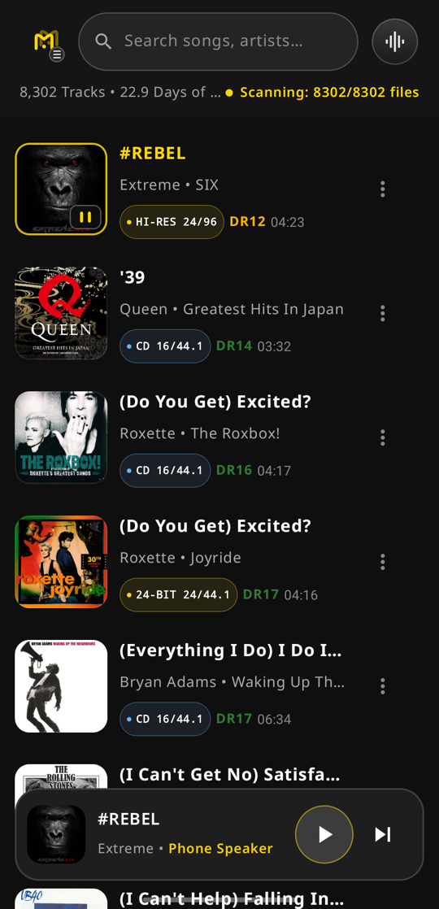
  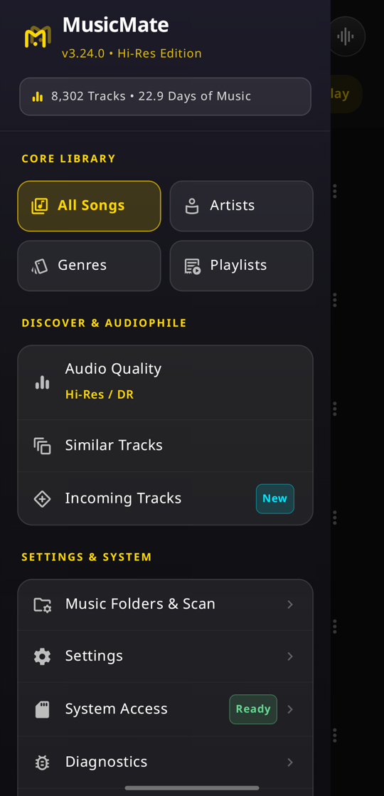
  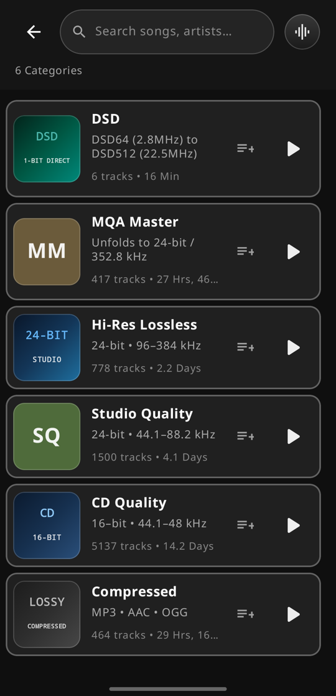
</p>

The main screen lists your songs with their quality badge (such as `HI-RES 24/96` or `CD 16/44.1`), dynamic range (`DR12`) and length. The header shows the number of tracks and how long the whole collection would take to play.

**Search** from the box at the top.

**Open the menu** with the MusicMate logo at the top left. It has three groups.

- **Core Library.** All Songs, Artists, Genres and Playlists.
- **Discover & Audiophile.**
  - **Audio Quality** groups songs into DSD, MQA, Hi-Res Lossless, Studio Quality and other tiers.
  - **Similar Tracks** finds possible duplicates: songs with the same title, and by default the same artist.
  - **Incoming Tracks** lists songs that have arrived but are not organized yet, such as downloads.
- **Settings & System.** Music Folders & Scan, Settings, System Access and Diagnostics. Diagnostics is a crash log that is useful when reporting a problem.

Category cards (an artist, a genre, a playlist) have their own **Play** and **Add to queue** buttons. Tap the card itself to see its songs.

**Playlists.** Built-in smart playlists fill themselves from your library, for example *Audiophile Sanctuary (DR12+)*, *Lossless Master Vault*, *Pure DSD Archive* and *Studio Masters (Hi-Res)*. Tap **New smart playlist** to make your own from rules such as minimum DR, Hi-Res only or lossless only. Press and hold one of your own playlists to delete it.

---

## 3. Playing music

**Tap a song to play it.** Playback starts at that song and continues through the list you are looking at. Tapping the cover art also plays the song. Press and hold a song to open its details instead. You can swap these in [Settings](#10-settings).

**The player bar** appears at the bottom once something is playing. It shows the song, where it is playing (for example *Phone Speaker* or *HiBy R3*), Play/Pause and Next. Tap it to open Music Center. Press and hold it to scroll the list to the song that is playing.

<p align="center">
  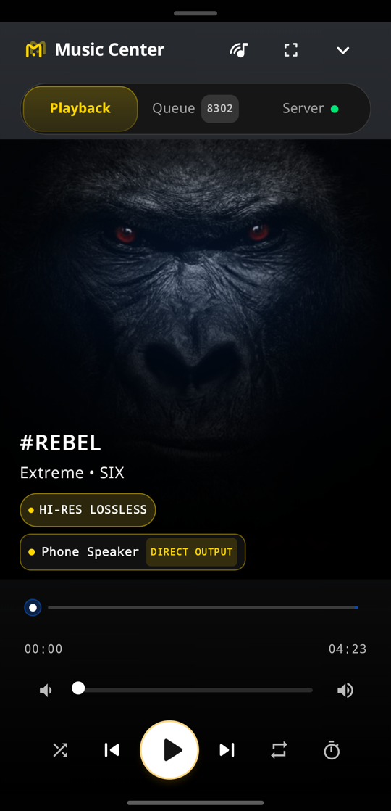
  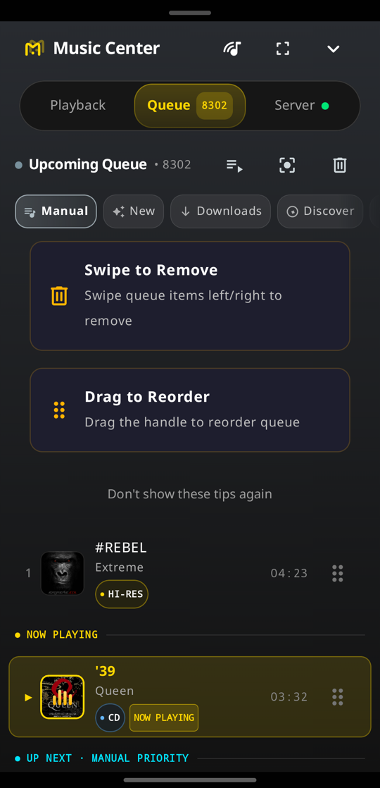
  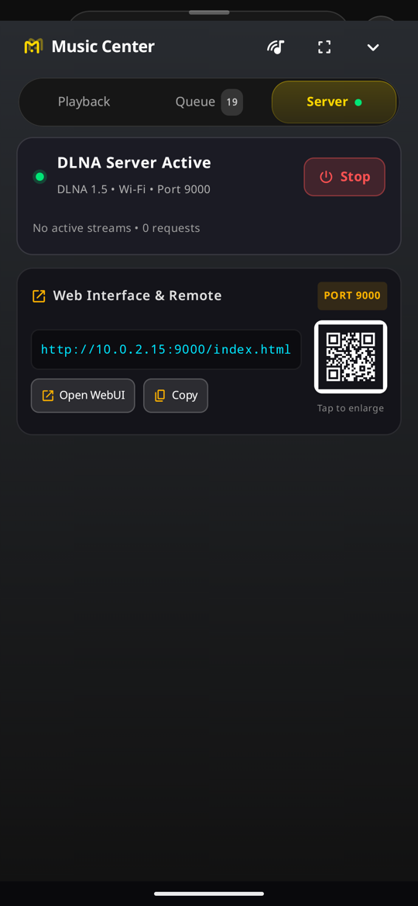
</p>

**Music Center** has three tabs. Tap a tab or swipe between them.

- **Playback.** Cover art, the song's quality and where it is playing (for example `Phone Speaker · DIRECT OUTPUT`), a seek bar, volume, and shuffle, repeat and sleep timer controls.
- **Queue.** The songs coming up. See [The queue](#4-the-queue).
- **Server.** The media server that lets other devices play your music. See [Streaming](#6-streaming-to-other-devices).

The icons at the top of Music Center pick a player, open the Studio Console, and close the sheet.

**Studio Console** is a full-screen, landscape player with analog VU meters, a tape deck view or large cover art, and the song's format and DR. It is made for leaving on a desk or stand. A setting keeps the screen awake while it is open.

<p align="center">
  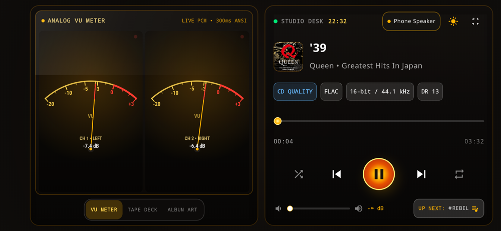
</p>

**Headphones and Bluetooth.** Playback pauses when wired or Bluetooth headphones, a Bluetooth DAC or a car disconnects, so music never jumps to the phone speaker by surprise.

---

## 4. The queue

Open **Music Center**, then **Queue**.

- **Swipe** a song left or right to remove it.
- **Drag** the handle on the right to reorder.
- The buttons at the top **load a playlist**, **jump to the song that is playing**, and **clear the queue**.

**Play Next** and anything you add yourself always come before automatic suggestions.

**Automatic sources.** The row of buttons under the header decides what MusicMate adds when the queue runs low.

| Source | What it adds |
|:---|:---|
| **Manual** | Nothing. The queue only changes when you change it. Shuffle and repeat work in this mode. |
| **New** | Songs in the New category, which are songs not yet organized. |
| **Downloads** | Songs from your download folders, including ones you have heard. |
| **Discover** | Songs you have never finished playing in MusicMate. Counting starts from when you began using this version. |
| **Rediscover** | Songs you finished before but have not played for at least 30 days, oldest first. |
| **Playlist ▾** | Songs from a smart playlist or one of your own. |

An automatic source keeps up to 20 songs ready, adds them without interrupting what is playing, and never adds a song you removed. Shuffle and repeat stay off so the order is predictable. When there is nothing left to add, the queue says so instead of starting over.

**Loading a playlist** offers three choices: **Play All** replaces the queue and starts playing, **+ Queue** adds the playlist to the end, and **Auto** makes it the automatic source.

Your queue, source and current song are kept when you close the app. Playback does not resume on its own.

---

## 5. Choosing where to play

<p align="center">
  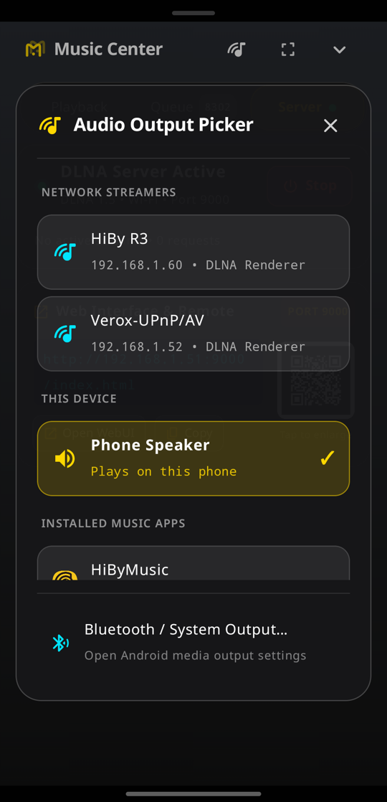
</p>

Tap the player icon in Music Center to choose where music plays.

- **Network Streamers.** DLNA/UPnP players on your network or on the phone's hotspot, such as a HiBy, WiiM or Eversolo, shown with their address.
- **This Device.** The phone speaker, a USB DAC (shown as *USB Bit-Perfect Output*) or Bluetooth headphones (shown with the codec, for example *Bluetooth · LDAC*).
- **Installed Music Apps.** Other players such as HiByMusic, Poweramp or UAPP. These need External Player Access.
- **Bluetooth / System Output…** opens Android's output panel to connect or switch Bluetooth devices.

The list keeps updating while it is open, so a player that has just been switched on appears without closing the picker. MusicMate also notices when you turn the phone's hotspot on or off, and finds players on the new network by itself.

---

## 6. Streaming to other devices

MusicMate runs a DLNA media server on your phone, so other devices can browse and play your library directly. Audio is sent unchanged, with no transcoding.

**Server tab.** Music Center's Server tab shows whether the server is running, the network it is on and its port (9000). While music streams it shows live activity, for example `2 streams • 9.0 MB/s • 1,204 requests`.

- Tap **Stop** to turn the server off. It stays off, even after reopening the app, until you tap **Start**. Choosing a network player starts it again when needed.
- **Control apps** such as mConnect or BubbleUPnP see MusicMate as a media server. Browse your library there and play to any renderer, with full tags and cover art.
- **Web remote.** Open the address shown under *Web Interface & Remote*, for example `http://192.168.1.51:9000/index.html`, in a browser on the same network. **Open WebUI** and **Copy** help with that, and the QR code opens it on another phone.

Streaming works on home Wi-Fi and on the phone's own hotspot, including both at once.

---

## 7. Song details and tags

<p align="center">
  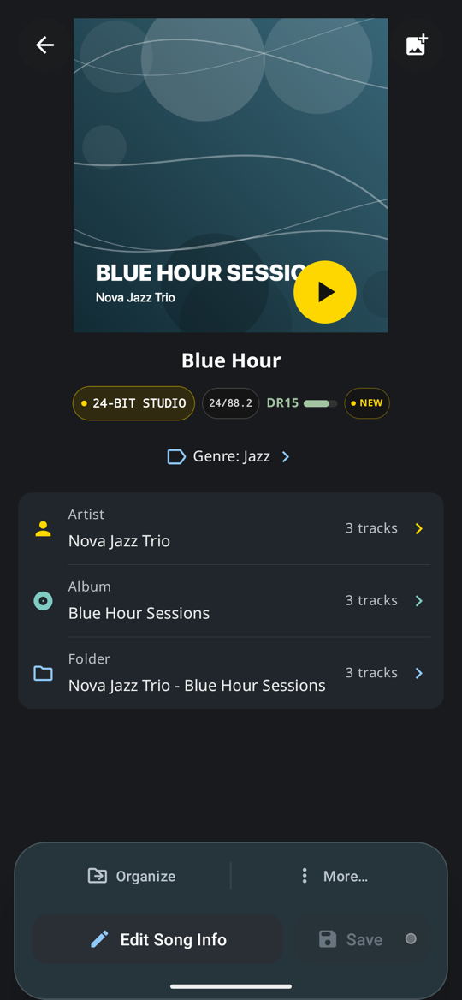
  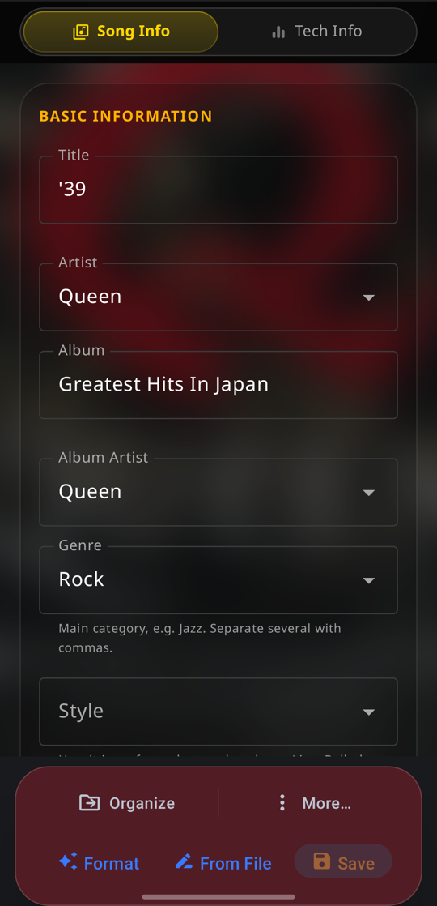
  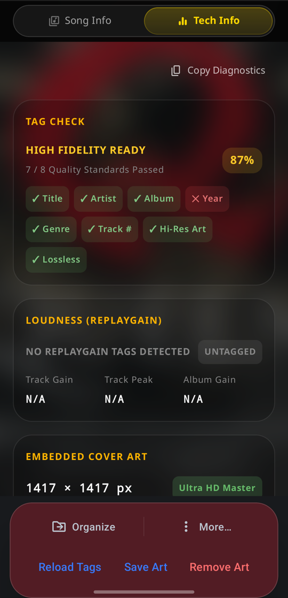
</p>

Press and hold a song to open its details. The screen shows the cover, quality and DR, the genre, and shortcuts to the same artist, album and folder. The play button on the cover plays the song.

**Edit Song Info** opens the editor.

- Fields are grouped under **Song Info**: title, artist, album, album artist, genre, style, mood and more.
- Genre, Style, Mood and Origin open a list of ready-made choices. The current value is ticked, and typing filters the list. To give a song several genres, separate them with commas.
- **Save** lights up once something has changed. Back asks before discarding unsaved edits.
- **Format** cleans up the tag text. Press and hold it to run the full clean-up.
- **From File** suggests tags read from the file name, for you to review.

**Tech Info** shows a tag check (which important tags are present), ReplayGain loudness values, and embedded cover art size. **Reload Tags** reads the file again.

**More…** has further actions:

- **Add to Playlist…**
- **Search & Match Tags** looks the song up on MusicBrainz. Matches become unsaved edits you can review before saving.
- **Smart Clean & Format**
- **Verify Lossless Quality** shows the frequency spectrum, which reveals files upsampled from CD or converted from lossy audio.
- **Show in File Manager**
- **Search Song on Web**
- **Delete**

**Organize** moves the file into your Music folder, named from its tags:

```text
Music/<Album Artist>/<Album> (<quality>)/<track number> - <title>.<ext>
```

The artist is used when there is no album artist. The quality, such as Hi-Res or MQA, is added to the album folder for anything better than CD.

Each song in a list also has a **⋮** menu for quick actions: Play Now, Play Next, Add to Queue, Add to Playlist…, Go to Artist, Go to Album, Convert Format and Open in External App.

---

## 8. Working with many songs

To change several songs at once, set **When I tap a track** to **Edit tags** in [Settings](#10-settings). Then press and hold a song to start selecting, and tap more songs to add them. The bar at the top shows how many are selected and offers:

- **Edit Tags.** Change a field for every selected song at once. Fields that differ between songs are left alone unless you change them.
- **Add to Playlist**
- **Move Files**
- **Convert Files**
- **Delete**
- **Select All**

---

## 9. Audio quality and dynamic range

Each song shows a quality badge and a DR value.

- **Quality badges.**
  - `CD` is 16-bit lossless.
  - `24-BIT` is studio quality, 24-bit at 44.1 to 88.2 kHz.
  - `HI-RES` is 24-bit at 96 kHz or higher.
  - `DSD` is Direct Stream Digital.
  - `MQA` marks MQA-encoded files. Expanded badges tell `MQA MASTER` from `MQA STUDIO`, and show the original sample rate when the file records it.
- **DR (dynamic range)** measures how much the music breathes between quiet and loud. Higher is better: green is 13 and above, gold is 8 to 12, and orange is below 8. Heavily compressed modern masters often score DR5 to DR7.

The [Music Quality Guide](MUSIC_QUALITY_GUIDE.md) explains bit depth, sample rate and dynamic range in more detail.

---

## 10. Settings

<p align="center">
  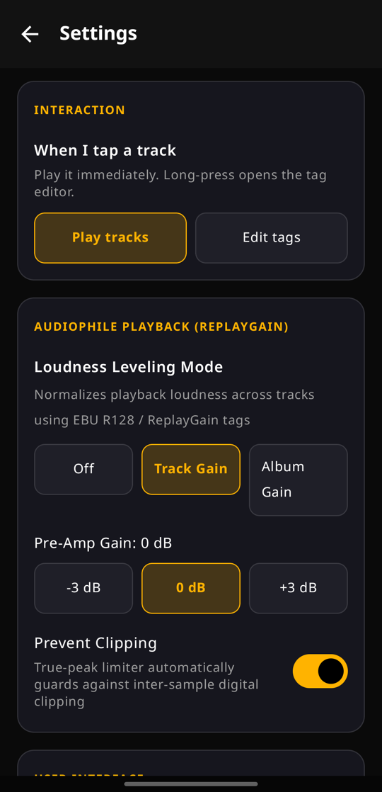
</p>

- **When I tap a track.**
  - **Play tracks** (default): tap plays, and press and hold opens the details.
  - **Edit tags**: tap opens the details, and press and hold starts selecting several songs.
- **Loudness Leveling Mode** evens out volume between songs using ReplayGain or EBU R128 tags. **Track Gain** levels every song. **Album Gain** keeps the loudness differences within an album.
  - **Pre-Amp Gain** raises or lowers the result.
  - **Prevent Clipping** stops loud peaks from distorting.
- **Display options.**
  - Show storage use in the menu.
  - Show track numbers before titles.
  - Scroll the list to the playing song automatically.
  - Match similar songs by title and artist, or by title only.
  - Keep the screen awake in the Studio Console.

---

## 11. Troubleshooting

**A network player does not appear.**

1. Check that the player is on the same Wi-Fi as the phone, or connected to the phone's hotspot.
2. Make sure the server is running in Music Center's Server tab.
3. Leave the picker open for a few seconds. New players appear by themselves.

**The header says Analyzing for a long time.** After a first scan MusicMate measures every track, which takes a while on a large library. You can keep using the app. Progress is kept if it stops, and it continues later.

**A song shows `--` instead of a DR value.** It has not been analyzed yet. DSD files currently never get a DR value, because Android has no DSD decoder.

**Tags changed in another app do not show.** Run **Full Rescan** from **Music Folders & Scan**.

**The app will not install from GitHub.** Releases before 3.24.0 were unsigned and cannot be installed. If you have MusicMate from another source, uninstall it once and install the latest release. Uninstalling removes the library and settings, so plan to rescan.

**Something crashed.** Open **Diagnostics** from the menu and include what it shows when you report the problem.
