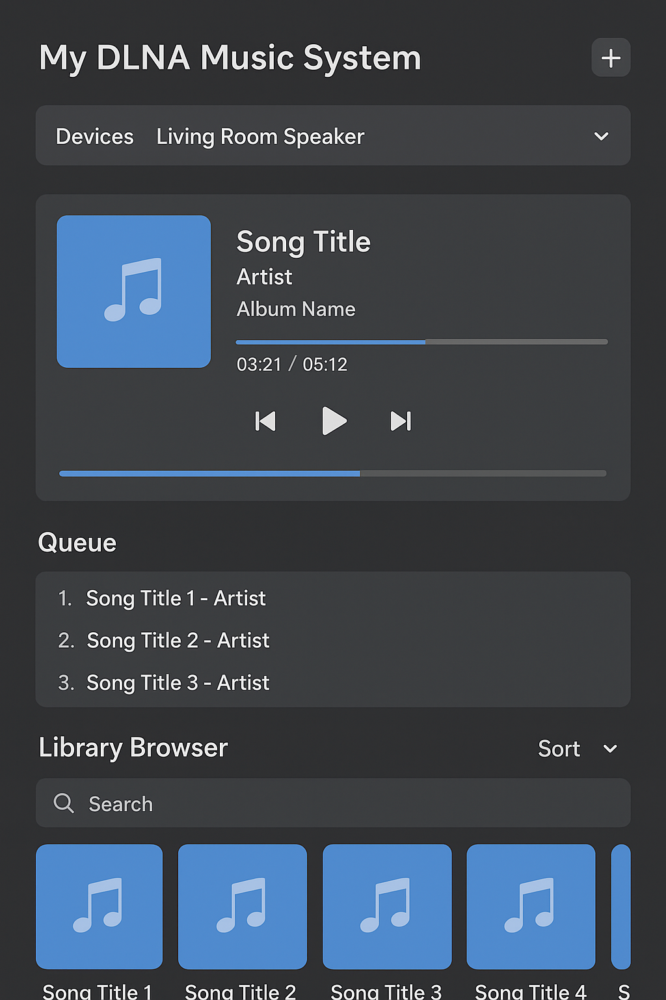
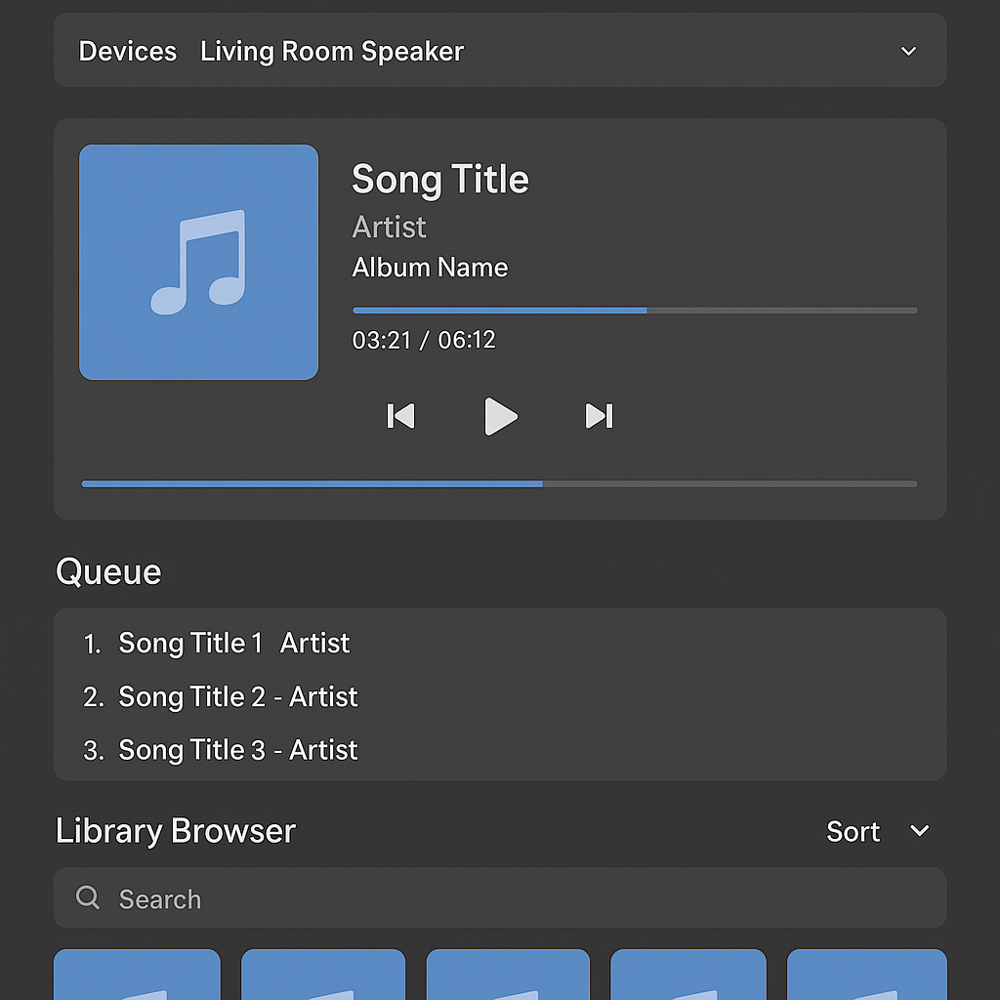

# The New MusicMate Ecosystem Architecture

## 1. The MusicMate Server (The "Core")

This is the heart of the system, running as a background service inside the MusicMate app on a single Android Device. It hosts two servers simultaneously:

-   **DLNA Digital Media Server (DMS):**
    -   **Purpose:** Compatibility.
    -   **Function:** Scans the music library and advertises it using standard UPnP protocols.
    -   **Technology:** `jupnp`.
    -   **Result:** Any DLNA player on the network (e.g., RopieeeXL, Volumio, a smart TV) can see and play music from it.

-   **Web Server (HTTP Server):**
    -   **Purpose:** Control.
    -   **Function:** Serves a modern web application that will act as the "Roon-like" remote.
    -   **Technology:** `jetty-server12` is perfect for embedding a powerful web server directly in the app.

## 2. The Players (The "Endpoints" / DMRs)

-   As specified, these can be any standard DLNA Digital Media Renderer on the network.
-   The MusicMate Server will discover these devices using UPnP discovery and maintain a list of available players.

## 3. The Remote Control (The "DMC" / Web Application)

-   This is no longer part of the native Android app's UI. It's a web page.
-   A user on any device (phone, tablet, laptop) opens a web browser and navigates to the IP address of the MusicMate Server device (e.g., `http://192.168.1.10:8080`).
-   This web app, served by Jetty, provides the rich interface to browse the library and control playback on any discovered players.

## The Control Flow

1.  The user opens `http://<musicmate-ip-address>:9000/` in their browser.
2.  The web app loads. It makes API calls back to the MusicMate server to get a list of available DLNA players and the music library content.
3.  The user browses their library (artists, albums, etc.) in the web UI.
4.  The user selects a track to play and chooses a target player (e.g., "RopieeeXL").
5.  The web UI sends a command to the MusicMate server's API (e.g., `POST /api/play` with `track_id` and `player_id`).
6.  The MusicMate server receives this API call. It then sends the appropriate DLNA command (`SetAVTransportURI` followed by `Play`) to the selected RopieeeXL player.
7.  The RopieeeXL player starts streaming the music directly from the MusicMate DLNA server.

## Let's Start Building: Step-by-Step

This is a fantastic and achievable plan. To make this happen, we need to implement the server components. Let's start with the foundation: getting the embedded Jetty web server running.

> I will now create a new Java class, `WebServer.java`, inside the `apincer.android.mmate.server` package. This class will be responsible for starting and stopping a simple Jetty server that can serve files and handle API requests.
>
> Does this initial step of creating the web server foundation align with your vision?
> 
> 
>  ┌───────────────────────────┐
│  Web Browser (UI)         │
│  - Device list            │
│  - Play queue              │
│  - Library browser         │
│  - Playback controls       │
└─────────────▲─────────────┘
│ WebSocket / HTTP
│
┌─────────────┴───────────────────┐
│  Java DLNA Server (Backend)     │
│                                 │
│  ┌───────────────────────────┐  │
│  │  DMS (Digital Media Server)│  │
│  │  - Serves music files      │  │
│  │  - Metadata & album art    │  │
│  └───────────────────────────┘  │
│                                 │
│  ┌───────────────────────────┐  │
│  │  DMC (Digital Media Ctrl.) │  │
│  │  - Discover renderers      │  │
│  │  - Send AVTransport cmds   │  │
│  │  - Volume/seek control     │  │
│  │  - Event subscriptions     │  │
│  └───────────────────────────┘  │
│                                 │
│  ┌───────────────────────────┐  │
│  │ Optional Local Renderer   │  │
│  │  - Plays directly on host │  │
│  │  - For testing/fallback   │  │
│  └───────────────────────────┘  │
└─────────────────────────────────┘
│
│ UPnP / DLNA network commands
▼
┌───────────────────────────┐
│  DLNA Renderers (DMR)     │
│  - MPD DLNA renderer      │
│  - Smart speakers         │
│  - TVs                    │
└───────────────────────────┘

┌────────────────────────────────────────────────────────────┐
│  🎵  My DLNA Music System                                   │
│────────────────────────────────────────────────────────────│
│  Devices: [Living Room Speaker ▼] [ + ]                    │
│────────────────────────────────────────────────────────────│
│  [ Album Art ]     Now Playing: Song Title - Artist         │
│                    Album: Album Name                        │
│                                                              │
│                    [⏮] [▶️ / ⏸] [⏭]   ⏱ 03:21 / 05:12       │
│                    Seek: [■■■■□□□□□□]                       │
│                    Volume: 🔈 [■■■■■□□□□]                   │
│────────────────────────────────────────────────────────────│
│  Queue (This Device)                                        │
│  1. Song Title 1 - Artist                                   │
│  2. Song Title 2 - Artist                                   │
│  3. Song Title 3 - Artist                                   │
│────────────────────────────────────────────────────────────│
│  Library Browser                                             │
│  [Search: ___________]  [Sort ▼]                            │
│                                                              │
│  🎵 Album 1       🎵 Album 2       🎵 Album 3                 │
│  🎵 Album 4       🎵 Album 5       🎵 Album 6                 │
└────────────────────────────────────────────────────────────┘

Alright — here’s a **Roon-style but simplified web UI wireframe** for your DLNA ecosystem.
I’m keeping it clean so it’s easy to code first, then polish later.

---

## **Web UI Wireframe (Single Page)**

```
┌────────────────────────────────────────────────────────────┐
│  🎵  My DLNA Music System                                   │
│────────────────────────────────────────────────────────────│
│  Devices: [Living Room Speaker ▼] [ + ]                    │
│────────────────────────────────────────────────────────────│
│  [ Album Art ]     Now Playing: Song Title - Artist         │
│                    Album: Album Name                        │
│                                                              │
│                    [⏮] [▶️ / ⏸] [⏭]   ⏱ 03:21 / 05:12       │
│                    Seek: [■■■■□□□□□□]                       │
│                    Volume: 🔈 [■■■■■□□□□]                   │
│────────────────────────────────────────────────────────────│
│  Queue (This Device)                                        │
│  1. Song Title 1 - Artist                                   │
│  2. Song Title 2 - Artist                                   │
│  3. Song Title 3 - Artist                                   │
│────────────────────────────────────────────────────────────│
│  Library Browser                                             │
│  [Search: ___________]  [Sort ▼]                            │
│                                                              │
│  🎵 Album 1       🎵 Album 2       🎵 Album 3                 │
│  🎵 Album 4       🎵 Album 5       🎵 Album 6                 │
└────────────────────────────────────────────────────────────┘
```

---

### **Key UI Sections**

1. **Top Bar**

    * App name/logo
    * Selected device dropdown (lists all DLNA renderers found via DMC)
    * `+` button to refresh/discover new devices

2. **Now Playing Area**

    * Album art
    * Song title, artist, album info
    * Playback controls: prev, play/pause, next
    * Seek bar & elapsed time
    * Volume slider

3. **Queue Panel**

    * List of upcoming tracks for the selected device
    * Click to jump to any track
    * Option to remove/reorder (later feature)

4. **Library Browser**

    * Search bar
    * Sort/filter options (by artist, album, format, year)
    * Grid view of albums with cover art
    * Clicking an album opens tracklist with “Play now / Add to queue”

---

### **UX Flow**

* User **selects a device** → UI updates to show its current queue and now playing info.
* Clicking “Play” sends **SetAVTransportURI** from Java backend to that renderer.
* Queue changes sync in real time via **WebSocket**.
* Library browsing does not interrupt playback; user can queue new songs anytime.

---

If you want, I can also make you a **color-coded UI mockup** (realistic, with spacing and Roon-like polish) so you can hand it straight to a frontend developer or start building it with Tailwind + WebSockets.

Do you want me to make that polished mockup?



ipad version



           ┌─────────────────────────────┐
           │   Local Music Library       │
           │   (FLAC, MP3, etc.)         │
           └──────────────┬──────────────┘
                          │
                 [1] Scan & Extract Tags
                          │
               ┌──────────▼──────────┐
               │  Tag Extractor      │
               │  (jaudiotagger)     │
               └──────────┬──────────┘
                          │
                [2] Match with APIs
                          │
         ┌────────────────┼─────────────────────┐
         │                │                     │
┌────────▼────────┐┌──────▼─────────┐ ┌─────────▼─────────┐
│ MusicBrainz API ││ Discogs API    │ │ Last.fm API       │
│ - IDs           ││ - Credits      │ │ - Bios, Tags      │
│ - Release Data  ││ - Labels       │ │ - Similar Artists │
└────────┬────────┘└──────┬─────────┘ └─────────┬─────────┘
│                 │                     │
└─────────────────┴─────────────────────┘
│
[3] Consolidate Metadata
│
┌──────────▼──────────┐
│   Metadata Store    │
│ (SQLite/PostgreSQL) │
└──────────┬──────────┘
│
[4] Serve to Ecosystem
│
┌────────────────────┼────────────────────┐
│                    │                    │
┌────▼────┐        ┌──────▼─────┐        ┌─────▼───────┐
│ DLNA    │        │ Web API    │        │ WebSocket   │
│ DMS/DMC │        │ (JSON Rich │        │ Real-time   │
│ (Basic) │        │  Metadata) │        │ UI Updates  │
└────┬────┘        └──────┬─────┘        └─────┬───────┘
│                    │                    │
▼                    ▼                    ▼
DLNA Renderers      Web Browser UI      Queue/Now Playing
(limited info)      (Roon-like views)   sync with metadata

Here’s the **metadata enrichment architecture** for your Java DLNA + controller ecosystem so you can get Roon-like rich info.

---

## **Architecture: Rich Metadata Flow**

```
           ┌─────────────────────────────┐
           │   Local Music Library       │
           │   (FLAC, MP3, etc.)         │
           └──────────────┬──────────────┘
                          │
                 [1] Scan & Extract Tags
                          │
               ┌──────────▼──────────┐
               │  Tag Extractor      │
               │  (jaudiotagger)     │
               └──────────┬──────────┘
                          │
                [2] Match with APIs
                          │
         ┌────────────────┼─────────────────────┐
         │                │                     │
┌────────▼────────┐┌──────▼─────────┐ ┌─────────▼─────────┐
│ MusicBrainz API ││ Discogs API    │ │ Last.fm API       │
│ - IDs           ││ - Credits      │ │ - Bios, Tags      │
│ - Release Data  ││ - Labels       │ │ - Similar Artists │
└────────┬────────┘└──────┬─────────┘ └─────────┬─────────┘
         │                 │                     │
         └─────────────────┴─────────────────────┘
                          │
              [3] Consolidate Metadata
                          │
               ┌──────────▼──────────┐
               │   Metadata Store    │
               │ (SQLite/PostgreSQL) │
               └──────────┬──────────┘
                          │
                [4] Serve to Ecosystem
                          │
     ┌────────────────────┼────────────────────┐
     │                    │                    │
┌────▼────┐        ┌──────▼─────┐        ┌─────▼───────┐
│ DLNA    │        │ Web API    │        │ WebSocket   │
│ DMS/DMC │        │ (JSON Rich │        │ Real-time   │
│ (Basic) │        │  Metadata) │        │ UI Updates  │
└────┬────┘        └──────┬─────┘        └─────┬───────┘
     │                    │                    │
     ▼                    ▼                    ▼
 DLNA Renderers      Web Browser UI      Queue/Now Playing
 (limited info)      (Roon-like views)   sync with metadata
```

---

## **Flow Explanation**

1. **Scan & Extract Tags**

    * Use `jaudiotagger` in Java to get Artist, Album, Title, Duration, Track No, Disc No, Year.
    * Normalize text for better API matching.

2. **Match with APIs**

    * Search MusicBrainz → get MBID (MusicBrainz ID).
    * If not found, try Discogs.
    * Optionally call Last.fm for bios and tags.

3. **Consolidate Metadata**

    * Merge data from multiple APIs.
    * Store in a DB with a **foreign key to your local file path**.
    * Include:

        * Artist image
        * Biography
        * Album art (multiple resolutions)
        * Credits list
        * Genres, moods, year, label
        * Audio analysis (BPM, key, DR score)

4. **Serve to Ecosystem**

    * **DLNA DMS/DMC** sends *basic* tags in DIDL-Lite (title, album, artist, cover art).
    * **Web API** serves *full* metadata for your custom web UI.
    * **WebSocket** keeps “Now Playing” and queue in sync with metadata and cover art.

---

If you want, I can also design a **Roon-style artist page & album page UI** for your web app so all this metadata is displayed in a visually rich way.
That way you’ll see exactly where this extra data fits.

Do you want me to make those two page mockups?


We can definitely add a **Now Playing** section with Roon-style rich metadata — cover art, track title, artist, album, release year, genre, resolution/bit-depth, even waveform progress.

Here’s the approach for your DLNA + Roon-like setup:

---

### **Backend (Java DLNA Server)**

1. **Fetch Now Playing from Renderer**

    * DLNA renderers typically support `AVTransport` + `RenderingControl` actions:

        * `GetMediaInfo` → URI
        * `GetPositionInfo` → track title, artist, album, duration, elapsed
    * If your renderer is only giving you a URI, resolve metadata by:

        * Looking up in your server’s media database
        * Querying external APIs (MusicBrainz, Last.fm, Tidal, Qobuz, etc.)

2. **Metadata Enrichment**

    * Use the URI or artist/album tags to fetch:

        * Album art (high res, 1000×1000+)
        * Release date
        * Bit depth, sample rate (if known)
        * Similar artists / “next” recommendations
    * Cache results in your server to reduce API calls.

3. **WebSocket Push**

    * Push Now Playing updates to the Web UI in real time so you get seamless updates when the song changes.

---

### **Frontend (Web/iPad UI)**

* **Now Playing Bar** (always visible at bottom):

    * Large album art thumbnail
    * Track title & artist
    * Resolution / format (e.g., `FLAC 24/96`)
    * Elapsed time & total time (progress bar)
* **Expanded View** (when tapped):

    * Full-screen album art
    * Full metadata (year, genre, composer, label)
    * Queue next/previous buttons
    * Possibly waveform scrubbing (if you can precompute waveforms)
    * “More by this artist” and “Related albums” section

---

If you want, I can add a **full Now Playing + Metadata React component** to the code we started so it integrates directly with your DLNA server’s API.
That would include WebSocket updates and a metadata fetch layer.

Do you want me to add that **in the same Roon-like UI file** or as a **separate NowPlaying component**?
Separate makes it reusable.

┌──────────────────────────────┐
│          CONTROLLER           │
│  (Web UI / Mobile App)        │
│  - Browse library             │
│  - Control playback           │
│  - Display now playing        │
│  - Show rich metadata         │
└───────────▲───────────────────┘
│ WebSocket / REST (JSON)
▼
┌──────────────────────────────┐
│             CORE              │
│  (Java DLNA Server)           │
│                               │
│  Modules:                     │
│  - Library Manager            │
│      - Local file scan        │
│      - Metadata fetcher       │
│  - Playback Session Manager   │
│      - Track queue            │
│      - Multi-zone tracking    │
│  - DLNA Control Point         │
│      - Sends play/pause/seek  │
│      - Gets renderer state    │
│  - Metadata Enrichment        │
│      - MusicBrainz API        │
│      - Discogs API            │
│      - Local tags (ID3, FLAC) │
│  - Now Playing Sync Service   │
│      - Push to Controller UI  │
│      - Sync across devices    │
└───────────▲───────────────────┘
│ UPnP AVTransport / DLNA HTTP
▼
┌──────────────────────────────┐
│           RENDERER            │
│  (MPD DLNA Renderer)          │
│                               │
│  - Receives HTTP audio stream │
│  - Reports playback position  │
│  - Supports gapless if MPD    │
│    settings allow             │
└──────────────────────────────┘

